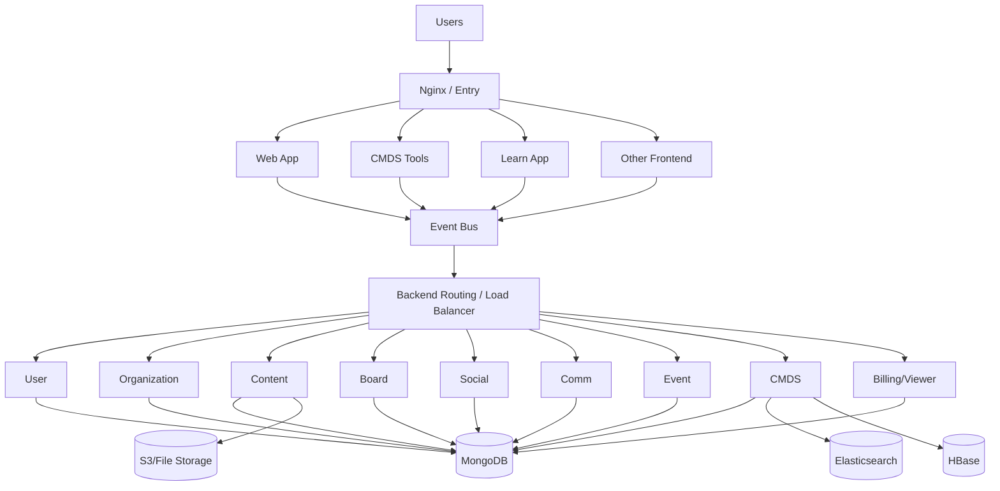
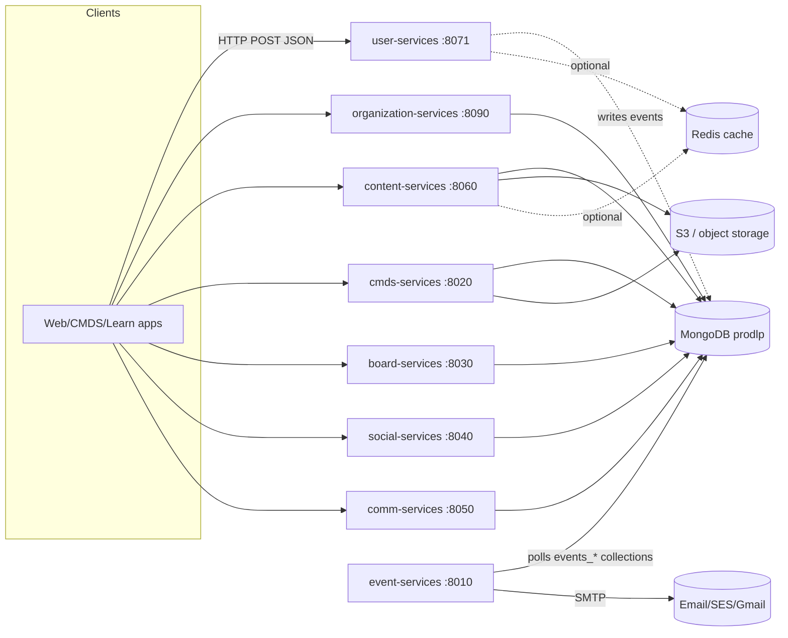

# Uprep Unified Design + Runbook

## 1) Document Purpose

This is the single source of truth for:

1. deep architecture/design understanding of Uprep in this workspace
2. setup, build, startup, verification, and troubleshooting runbook

This file replaces the need to read separate design and runbook PDFs.

## 2) System Context

The workspace contains multiple projects from different eras and stacks. The practical local activation path is:

- `uprep-website-master` (PHP website/UI)
- `virtual-classroom-service-main` (Spring Boot)
- `lms_nextgen-master` (core microservices for current backend)

Other projects (especially `lms-master`) are legacy and require older runtime ecosystems (Play + Java 6 style dependencies), so they are not part of the default local execution path.

## 3) Architecture (In-depth)

### 3.1 Product-level architecture from source PDF

From `UPrep_LMS_Sankar.pdf` (architecture page):

- frontend tier (4 microservices/apps) behind an entry layer
- backend tier (9 microservices/domains)
- event bus between request sources and backend processing
- data/storage tier (MongoDB, HBase, Elasticsearch, S3/File storage)

### 3.2 Logical architecture diagram



### 3.3 Codebase architecture inside `lms_nextgen-master`

`lms_nextgen-master` is organized by domains with a repeatable pattern:

- parent domain module (`user`, `organization`, `content`, `board`, `comm`, `social`, `cmds`, `event`)
- `*-management` module (domain logic + repositories + models)
- `*-services` module (Spring Boot API entrypoint + controllers/config)

Shared modules:

- `commons` (shared DTOs/utils/common infra)
- `redis-cache` (cache integration layer)

This is a layered modular monolith at build-time, but runtime becomes multi-service.

### 3.4 Dependency behavior

Build dependency order matters. Correct pattern:

1. install root parent (`lms`)
2. install domain parent (`user/pom.xml`, etc.)
3. build/install `*-management`
4. package `*-services`

If this order is not followed, Maven typically fails with missing `com.lms:*` snapshot artifacts.

### 3.5 Data and integration design

Primary local datastore:

- MongoDB (`localhost:27017`, database typically `prodlp`)

Known external dependency:

- virtual classroom create-meeting flow depends on `testvc.uprep.in` (BigBlueButton API)
- local service can run, but external-call endpoints fail when this host is unreachable

Other integration families present in configuration:

- SMTP
- S3/object storage
- legacy external hostnames for image/app domains

### 3.6 Runtime service map (local activated topology)

- `http://localhost:8000` — website
- `http://localhost:20000` — virtual-classroom-service
- `http://localhost:8010` — event-services
- `http://localhost:8020` — cmds-services
- `http://localhost:8030` — board-services
- `http://localhost:8040` — social-services
- `http://localhost:8050` — comm-services
- `http://localhost:8060` — content-services
- `http://localhost:8071` — user-services
- `http://localhost:8090` — organization-services

Most Spring services expose API docs at `/v2/api-docs`.

### 3.7 Design risks and operational constraints

1. config files contain environment secrets/keys in plain text
2. some profile values target non-local infra
3. legacy and nextgen stacks have different runtime assumptions
4. service startup order matters in build-time resolution
5. external integrations can appear as runtime failures even when build/start are successful

## 4) Setup and Execution Runbook

### 4.1 Prerequisites

- macOS terminal
- Java 17
- Maven 3.x
- MongoDB community
- PHP

Recommended environment variables:

```bash
export WORKSPACE="/Users/nagavenkatasatyas/dev/personal_projects/uprep/Uprep"
export JAVA_HOME="/opt/homebrew/opt/openjdk@17/libexec/openjdk.jdk/Contents/Home"
export PATH="$JAVA_HOME/bin:$PATH"
export M2_LOCAL="$WORKSPACE/.m2repo"
mkdir -p "$M2_LOCAL"
```

### 4.2 Install/start MongoDB

```bash
brew tap mongodb/brew
brew install mongodb-community
brew services start mongodb-community
mongosh --eval "db.runCommand({ ping: 1 })"
```

Expected ping result includes `ok: 1`.

### 4.3 Build commands

#### A) Virtual classroom

```bash
cd "$WORKSPACE/virtual-classroom-service-main"
mvn -Dmaven.repo.local="$M2_LOCAL" -DskipTests clean package
```

#### B) `lms_nextgen-master` full domain build

```bash
cd "$WORKSPACE/lms_nextgen-master"

# root parent
mvn -N -Dmaven.repo.local="$M2_LOCAL" install

# user
mvn -N -Dmaven.repo.local="$M2_LOCAL" -f user/pom.xml install
mvn -Dmaven.repo.local="$M2_LOCAL" -DskipTests -f user/user-mgmt/pom.xml clean install
mvn -Dmaven.repo.local="$M2_LOCAL" -DskipTests -f user/user-services/pom.xml clean package

# board
mvn -N -Dmaven.repo.local="$M2_LOCAL" -f board/pom.xml install
mvn -Dmaven.repo.local="$M2_LOCAL" -DskipTests -f board/board-management/pom.xml clean install
mvn -Dmaven.repo.local="$M2_LOCAL" -DskipTests -f board/board-services/pom.xml clean package

# organization
mvn -N -Dmaven.repo.local="$M2_LOCAL" -f organization/pom.xml install
mvn -Dmaven.repo.local="$M2_LOCAL" -DskipTests -f organization/organization-management/pom.xml clean install
mvn -Dmaven.repo.local="$M2_LOCAL" -DskipTests -f organization/organization-services/pom.xml clean package

# content
mvn -N -Dmaven.repo.local="$M2_LOCAL" -f content/pom.xml install
mvn -Dmaven.repo.local="$M2_LOCAL" -DskipTests -f content/content-management/pom.xml clean install
mvn -Dmaven.repo.local="$M2_LOCAL" -DskipTests -f content/content-services/pom.xml clean package

# comm
mvn -N -Dmaven.repo.local="$M2_LOCAL" -f comm/pom.xml install
mvn -Dmaven.repo.local="$M2_LOCAL" -DskipTests -f comm/comm-management/pom.xml clean install
mvn -Dmaven.repo.local="$M2_LOCAL" -DskipTests -f comm/comm-services/pom.xml clean package

# social
mvn -N -Dmaven.repo.local="$M2_LOCAL" -f social/pom.xml install
mvn -Dmaven.repo.local="$M2_LOCAL" -DskipTests -f social/social-management/pom.xml clean install
mvn -Dmaven.repo.local="$M2_LOCAL" -DskipTests -f social/social-services/pom.xml clean package

# cmds
mvn -N -Dmaven.repo.local="$M2_LOCAL" -f cmds/pom.xml install
mvn -Dmaven.repo.local="$M2_LOCAL" -DskipTests -f cmds/cmds-management/pom.xml clean install
mvn -Dmaven.repo.local="$M2_LOCAL" -DskipTests -f cmds/cmds-services/pom.xml clean package

# event
mvn -N -Dmaven.repo.local="$M2_LOCAL" -f event/pom.xml install
mvn -Dmaven.repo.local="$M2_LOCAL" -DskipTests -f event/event-management/pom.xml clean install
mvn -Dmaven.repo.local="$M2_LOCAL" -DskipTests -f event/event-services/pom.xml clean package
```

### 4.4 Required event prod properties

`event-services` needs these keys in:

`event/event-services/src/main/resources/application-prod.properties`

- `task.batch.size`
- `task.thread.number`
- `task.sleep.time`

Without them, startup fails with unresolved placeholder exceptions.

### 4.5 Start commands

Run each long-running command in a separate terminal.

#### website

```bash
php -S localhost:8000 -t "$WORKSPACE/uprep-website-master"
```

#### virtual classroom

```bash
cd "$WORKSPACE/virtual-classroom-service-main"
java -jar target/virtualClassRoomService-0.0.1-SNAPSHOT.jar
```

#### `lms_nextgen-master` services

```bash
cd "$WORKSPACE/lms_nextgen-master"

java -Dspring.profiles.active=prod -Dserver.port=8010 -jar event/event-services/target/event-services-0.0.1-SNAPSHOT.jar
java -Dspring.profiles.active=prod -Dserver.port=8020 -jar cmds/cmds-services/target/cmds-services-0.0.1-SNAPSHOT.jar
java -Dspring.profiles.active=prod -Dserver.port=8030 -jar board/board-services/target/board-services-0.0.1-SNAPSHOT.jar
java -Dspring.profiles.active=prod -Dserver.port=8040 -jar social/social-services/target/social-services-0.0.1-SNAPSHOT.jar
java -Dspring.profiles.active=prod -Dserver.port=8050 -jar comm/comm-services/target/comm-services-0.0.1-SNAPSHOT.jar
java -Dspring.profiles.active=prod -Dserver.port=8060 -jar content/content-services/target/content-services-0.0.1-SNAPSHOT.jar
java -Dspring.profiles.active=prod -Dserver.port=8071 -jar user/user-services/target/user-services-0.0.1-SNAPSHOT.jar
java -Dspring.profiles.active=prod -Dserver.port=8090 -jar organization/organization-services/target/organization-services-0.0.1-SNAPSHOT.jar
```

### 4.6 Verification checklist

```bash
curl -I http://localhost:8000
curl "http://localhost:20000/virtualClass/getMeetingBySectionId?sectionId=test-section-1"

curl http://localhost:8010/v2/api-docs
curl http://localhost:8020/v2/api-docs
curl http://localhost:8030/v2/api-docs
curl http://localhost:8040/v2/api-docs
curl http://localhost:8050/v2/api-docs
curl http://localhost:8060/v2/api-docs
curl http://localhost:8071/v2/api-docs
curl http://localhost:8090/v2/api-docs
```

Expected: HTTP 200 for local services that started successfully.

## 5) Troubleshooting

### 5.1 Maven permission issues (`~/.m2`)

Always use:

```bash
-Dmaven.repo.local="$M2_LOCAL"
```

### 5.2 Parent/dependency unresolved

- install root parent
- install domain parent
- rebuild management module
- then package services

### 5.3 Port already in use

```bash
lsof -i :<PORT>
kill -9 <PID>
```

Or change `-Dserver.port`.

### 5.4 External host errors (`UnknownHostException`)

Usually a DNS/network/VPN issue for external dependency endpoints, not a local build problem.

### 5.5 Event service placeholder failure

Check `task.batch.size`, `task.thread.number`, and `task.sleep.time` in event prod properties.

## 6) Known Limitations

1. virtual classroom create-meeting path depends on external BBB host availability.
2. some profile configs are not purely local.
3. legacy `lms-master` not included in this quick execution path.

## 7) Recommended Next Improvements

1. create `start-all.sh` and `health-check.sh`
2. move credentials out of source properties
3. add local-only profile templates
4. add a dependency graph per domain in docs

---

# Part B — In-Depth Technical Review

This part is the result of a full source review of `lms_nextgen-master` (the active backend). It documents the real API surface, backend design, database design, a back-of-envelope scaling analysis, and concrete limitations/constraints found in code.

## B1) Architecture (Detailed, As-Built)

### B1.1 Deployment units

`lms_nextgen-master` is a Maven multi-module build that produces **independent Spring Boot fat-jars per domain**. There are 8 runnable domain services plus shared libraries:

| Domain service | Port | Build artifact | Role |
|---|---|---|---|
| user-services | 8071 | `user/user-services` | auth, profile, email/identity |
| organization-services | 8090 | `organization/organization-services` | orgs, members, programs, billing, campaigns |
| content-services | 8060 | `content/content-services` | content, tests, questions, analytics, discussions |
| cmds-services | 8020 | `cmds/cmds-services` | content mgmt & distribution (videos, docs, SD cards) |
| board-services | 8030 | `board/board-services` | taxonomy/board tree |
| social-services | 8040 | `social/social-services` | social/activity feeds |
| comm-services | 8050 | `comm/comm-services` | messaging, news feeds, remarks |
| event-services | 8010 | `event/event-services` | event bus consumers, mailer, bill mocker |

Shared libraries (not independently deployed): `commons`, `redis-cache`, and each domain's `*-management` module.

### B1.2 Key architectural characteristics (observed)

- **No API gateway / service discovery in nextgen.** Each service is a standalone Spring Boot app on a fixed port. The "Nginx + load balancer + event bus" in the source PDF is the *target* topology, not what the nextgen code wires up by itself.
- **Shared single MongoDB database** (`prodlp`) is used by all services in the current config. Logical separation is by collection, not by physical database.
- **Event bus is implemented as a MongoDB-backed polling queue** (see B3.4), not Kafka/RabbitMQ/SQS.
- **Inter-service comm is HTTP/RestTemplate** (synchronous) plus the shared DB.
- **Stateless web tier**: services rely on Mongo/Redis for state, so horizontal scaling is theoretically possible (with caveats in B5).

### B1.3 Runtime component diagram



## B2) API Design

### B2.1 API style

- **RPC-over-HTTP, POST-heavy.** Endpoints are verbs (e.g. `/users/authenticateUser`, `/contents/getContentLinks`), not REST resources.
- **Request binding via DTO objects** (`...Req`) with `javax.validation` `@Valid`.
- **Uniform response envelope**: almost everything returns `ResponseEntity<VedantuResponse>`.
- **API docs** via springfox-swagger `2.9.2` at `/v2/api-docs` (and Swagger UI).
- **Checked-exception model**: services throw `VedantuException` carrying a `VedantuErrorCode`.

### B2.2 Approximate endpoint inventory (by controller mapping count)

Counts are mapping annotations per controller from source scan (indicative of surface area):

| Service | Notable controllers (≈ mappings) |
|---|---|
| organization-services | `Organizations` (~82), `Members` (~47), `Licensing` (~8), `ActivityLogger` (~8), `SalesCampaigns` (~7), `Campaigns` (~7), `CampaignCodes` (~7), `Microsites` (~5) |
| content-services | `Analytics` (~35), `ContentController` (~14), `Challenges` (~13), `Questions` (~9), `Discussions` (~9), `Videos` (~7), `Modules` (~7), `ClassroomConnect` (~7), `Channels` (~6), `Tests`/`Comments`/`Assignments`/`Documents`/`Files` (~5 each) |
| cmds-services | `CMDSResources` (~20), `CMDSQuestions` (~13), `CMDSModules` (~11), `CMDSAssignments` (~9), `CMDSLibrary` (~8), `CmdsVideos` (~5) |
| user-services | `Users` (~21), `Blacklists` (~5), `UserUpgrades` (~2), `Application` (~2) |
| social-services | `Socials` (~11) |
| comm-services | `MessageCenter` (~14), `NewsFeeds` (~5), `StatusFeeds` (~5), `Remarks` (~4), `Uploads` (~3) |
| event-services | `EventBusProcessors` (~11), `Mailer` (~7), `BillMocker` (~3) |

Total active HTTP surface is on the order of **350–450 endpoints** across services.

### B2.3 Representative endpoints

- `POST /users/authenticateUser`, `/users/addUser`, `/users/getUserSelfFullProfile`, `/users/uploadProfilePic`
- `POST /contents/getContentLinks`, `/contents/getSecureLink`, `/contents/addRatingAndFeedback`
- `POST /organizations/...` (org/program/center/section/member lifecycle)
- `GET  /virtualClass/getMeetingBySectionId`, `POST /virtualClass/createMeeting` (separate service)

## B3) Backend Design

### B3.1 Layering

`controller -> service (interface + *Impl) -> manager / repository -> MongoDB`.

- Controllers are thin; they delegate to `@Autowired` service implementations.
- `*-management` modules hold managers, models, and Spring Data repositories.
- `commons` provides base model (`VedantuBaseMongoModel`), response envelope, exceptions, utilities, and the async executor.

### B3.2 Persistence access

- **Spring Data MongoDB repositories** (`MongoRepository`) per collection, plus **`MongoTemplate`** for dynamic/ad-hoc queries (notably in event producer and analytics).
- ~90+ repositories total (one per collection in most cases).

### B3.3 Async execution

- `commons/AsynExecutorService`: a singleton `ThreadPoolExecutor(0, asyn.executor.pool.size, 60s, SynchronousQueue, CallerRunsPolicy)` wrapped in an `ExecutorCompletionService`.
  - **CallerRunsPolicy** means under saturation the **request thread runs the task itself** — back-pressure that protects memory but can stall request latency.
  - `SynchronousQueue` means no buffering; tasks either get a thread or run on caller.

### B3.4 Event bus mechanism (important)

The "event bus" is a **DB-polling worker model** inside `event-services`:

- Producers issue `mongoTemplate.find(query, Document.class, "events_<EventType>")` against per-type event collections.
- `EventThreadManager` builds, per `EventType`, a `Task` with a **fixed thread pool** (`Executors.newFixedThreadPool(nThreads)`), batch size, and sleep interval, all from `task.batch.size`, `task.thread.number`, `task.sleep.time`.
- `Task.run()` loops: produce a batch → submit each event to the pool → `CountDownLatch`-style wait → if **nothing in a batch consumed successfully, the task stops itself**.
- Consumed events track `processedBy` / `nTries` for idempotency/retry.

Implications:
- Throughput is bounded by **poll interval × batch size × thread count**, not by a broker.
- It is **at-least-once** style with manual dedupe via `processedBy`.
- A poison batch can **halt a consumer** (`stop()` on zero success).

### B3.5 Cross-cutting

- **Auth/identity** lives in user-services (password + salt collections, social/auth types).
- **File handling** abstracted via `fs.class` (e.g. `S3Handler`) with S3 credentials in properties.
- **Email** via SMTP (SES/Gmail) configured per service.
- **Caching** via optional `redis-cache` module (Redis host/port configurable; default `localhost:6379`).

## B4) Database Design

### B4.1 Storage model

- **MongoDB is the system of record.** ~90+ collections across domains, all currently in one DB (`prodlp`).
- **S3/object storage** holds binary content (videos, docs, images); Mongo holds metadata + links.
- HBase/Elasticsearch appear in legacy/QA config and the source PDF but are **not wired into nextgen runtime** in this drop.

### B4.2 Collection map (by domain)

- **user**: `users`, `usersalts`, `logins`, `emailblacklists`, `useremailunsubs`, `userpoints`, `userpointsdetails`, `entityuseractionmapping`
- **organization/billing**: `organizations`, `orgmembers`, `orgprograms`, `orgcenters`, `orgdepartments`, `orgsections`, `categories`, `microsites`, `campaigns`, `campaigncodes`, `salescampaigns`, `usertokens`, `userstatelogs`, `testusers`, `boardMapping`, `activityrecords`, `transactions`, `orders`, `couponcodes`, `saledetails`, `teacheranalytics`, `plans`
- **content/analytics**: `modules`, `moduleschedules`, `usersmodulestatus`, `questions`, `cmdsquestions`, `tests`, `assignments`, `answers`, `solutions`, `comments`, `discussions`, `documents`, `files`, `videos`, `channels`, `schedule`, `challenges`, `challengetakens`, `challengeuserinfos`, `challengeleaderboard`, `entityhighscores`, `librarycontentlinks`, `multiplierpowers`, `doubttransactions`, `userentityattempts`, `userentityanalytics`, `userentityratings`, `useranalytics`, `userquestionattempts`, `userquestionanalytics`, `questionanalytics`, `entityanalytics`, `entityuseractionmapping`
- **cmds**: `cmdsvideos`, `cmdsdocuments`, `cmdsfiles`, `cmdsmodules`, `cmdsfolders`, `cmdstests`, `cmdsassignments` (`cmdassignments`), `cmdsquestionsets`, `cmdscontentlinks`, `contentgroups`, `sdcards`, `cardgroups`, `accesscodes`, `notifications`
- **comm**: `conversations`, `userconversations`, `usermailboxinfo`, `newsfeeds`, `newsactivity`, `newsnotifications`, `statusfeeds`, `remarks`, `entitysharemapping`
- **board**: `boards`, `granteeorgprograms`
- **commons/event**: `events` (+ `events_<EventType>`), `counters`, `filemetainfo`, `vedantuuniquecodes`, `entityoperationstatus`

### B4.3 Indexing strategy (observed)

Indexes are defined via annotations and are reasonably thought-out for multi-tenant access:

- **Unique business keys**: `users.username`, `usersalts`, `emailblacklists`, `Organization` aliases/domains, `TestUser` (3 unique fields), `vedantuuniquecodes(type,code)`, `counters(collection,field)`.
- **Tenant-scoped compound indexes**: `orgmembers(orgId,memberId)`, `(orgId,userId)`, `(orgId,profile,mappings.*)`; `orgcenters/orgdepartments(orgId,code)`; `categories(orgId,name)`; `orgprograms(orgId,departmentId,code)`.
- **Tree/taxonomy**: `boards` has 4 compound indexes incl. unique name/alias paths.
- **Analytics/leaderboard**: `challengeleaderboard(userId,challengeId,parent.*)` unique; various `@Indexed` on attempt/analytics docs.

### B4.4 Data modeling notes

- Common base: `VedantuBaseMongoModel` (id, recordState, timeCreated, lastUpdated) → soft-delete via `recordState`, audit timestamps.
- Heavy use of **embedded sub-docs** (e.g. org member `mappings`, credentials) and **denormalization** for read performance.
- **Sequence/counter** collection backs human-friendly IDs (`counters`, `*_sequence`).

## B5) Back-of-Envelope Scaling

> These are **engineering estimates** from the as-built design, not benchmarks. They are meant to size capacity and find the first bottleneck.

### B5.1 Assumptions

- Commodity nodes: app pod = 2 vCPU / 2–4 GB; MongoDB primary = 8 vCPU / 32 GB / SSD.
- Spring Boot + embedded Tomcat default ~200 worker threads/service.
- Typical request = 1–5 Mongo ops, p50 latency 5–20 ms when indexed.

### B5.2 Single-instance throughput (per service)

- Thread-bound ceiling ≈ `threads / avg_latency`.
  - At 200 threads and 20 ms/request → **~10,000 req/s theoretical**, realistically **~1,500–3,000 req/s** after GC/serialization/Mongo round-trips.
- CPU-bound JSON/validation typically caps a 2 vCPU pod closer to **~500–1,500 req/s** for mixed endpoints.

### B5.3 Horizontal scale (web tier)

- Services are stateless → scale by adding replicas behind a load balancer.
- Practical near-linear scaling to **tens of thousands of req/s** *until MongoDB becomes the bottleneck*.

### B5.4 The real ceiling: MongoDB

- All services share one DB/primary. **Writes funnel to a single primary.**
- A single well-provisioned primary handles roughly **a few thousand writes/s** and **tens of thousands of indexed reads/s** (reads scalable via secondaries).
- First scaling actions:
  1. add **read replicas** + read preference for analytics/feeds,
  2. **shard** hot collections (`userentityattempts`, `*analytics`, `events_*`, `orgmembers`) by `orgId`/`userId`,
  3. split the shared DB **per domain** to isolate write load.

### B5.5 Event pipeline throughput

- Throughput ≈ `threads_per_type × batch_size / processing_time + poll_overhead`.
  - Example: EXPORT type at 3 threads, batch 10, 50 ms/event → **~60 events/s/type**; CALCULATE_SIZE at 10 threads → **~200 events/s/type**.
- This is **fine for thousands of events/min**, but is **not** a high-throughput streaming bus. Polling adds latency = up to the sleep interval (e.g. 10 s for EXPORT).
- Scaling requires more threads/types or migrating to a real broker (Kafka) for >10k events/s.

### B5.6 Rough capacity targets

| Tier | Comfortable | Needs work beyond |
|---|---|---|
| Web (per service, 3–5 replicas) | 5k–10k req/s | LB + autoscaling |
| MongoDB (single primary) | ~3k writes/s, ~30k reads/s | replicas + sharding |
| Event pipeline | thousands/min | Kafka/broker for >10k/s |
| Storage (S3) | effectively unbounded | CDN for hot content |

**Bottom line:** the design comfortably supports a **mid-size multi-tenant LMS (hundreds of orgs, ~100k–500k users, low-thousands concurrent)**. Past that, the shared single MongoDB and the polling event bus are the first two things that must change.

## B6) Limitations & Constraints (In-Depth)

### B6.1 Architectural
1. **No gateway/discovery in nextgen** — clients/callers must know fixed ports/hosts; no central authz, routing, or rate limiting.
2. **Shared single MongoDB** — couples all domains to one failure/scaling domain; "microservices" share a database (distributed monolith risk).
3. **Synchronous inter-service calls** (RestTemplate) — cascading latency/failure without circuit breakers.
4. **Polling event bus** — latency bound by sleep interval; a zero-success batch stops a consumer; no broker durability/replay semantics.

### B6.2 Operational
5. **Secrets in source properties** — S3 keys, SMTP creds, payment keys committed in `application-*.properties`.
6. **Profiles not local-clean** — `prod`/`qa` reference external hosts (e.g. `3.7.93.20`, image/app domains, BBB `testvc.uprep.in`).
7. **Required-but-undocumented config** — e.g. event service hard-fails without `task.batch.size` / `task.thread.number` / `task.sleep.time`.
8. **No health/readiness probes or metrics** standardized across services; only swagger/sysinfo.

### B6.3 Data / correctness
9. **Cross-collection consistency is application-managed** — no multi-document transactions in use; partial failures possible.
10. **At-least-once events** rely on `processedBy`/`nTries` dedupe in app code.
11. **Soft deletes** via `recordState` — queries must consistently filter, or deleted data leaks.

### B6.4 Security
12. **RPC POST style without visible auth filter** in controllers — authz appears to be service-internal; needs verification before exposure.
13. **External BBB call** uses a shared secret checksum; secret is in config.

### B6.5 Build / runtime
14. **Build order coupling** — parents and `*-management` must be installed before `*-services`, or Maven fails on `com.lms:*` snapshots.
15. **Java target drift** — declared Java 11, run on Java 17; legacy `lms-master` needs a much older stack and is out of scope.
16. **Private repo references** — some POM metadata points at internal Nexus/Mulesoft repos that 401 without access.

### B6.6 Priority remediations (if productionizing)
1. Put an **API gateway** (authz, rate limit, routing) in front.
2. **Split DB per domain** + add **replicas**, then **shard** hot collections.
3. Externalize **secrets** to a vault; scrub committed creds.
4. Replace polling bus with **Kafka** (or at least add dead-letter + no self-stop) for high throughput.
5. Add **circuit breakers/timeouts** (Resilience4j) on inter-service calls.
6. Add **health/readiness/metrics** (Actuator + Prometheus) and a startup orchestrator.

---

## C) Cloud Deployment (Oracle Cloud Always-Free, Docker Compose)

The original deployment server no longer exists. The cheapest faithful host for this
Java + MongoDB stack is an **Oracle Cloud Always-Free Ampere VM** (`VM.Standard.A1.Flex`,
ARM64, up to 4 OCPU / 24 GB RAM, $0). The entire stack ships as Docker images via
`docker-compose.yml` at the repo root.

### C1 Why Oracle over Vercel/Supabase/Cloud Run
- **Vercel** = serverless/Node + static; cannot run long-lived Spring Boot JVMs or MongoDB.
- **Supabase** = managed Postgres; this stack is hard-wired to MongoDB.
- **Google Cloud Run** works for the JVMs but is stateless → still needs **MongoDB Atlas**
  (separate) and bills past free limits with 9 always-on services.
- **Oracle Ampere free VM** runs Mongo + all 9 services + the PHP site on one $0 box. Chosen.

### C2 Provision the VM
1. Compute → Instances → **Create instance**.
2. Image: **Canonical Ubuntu 22.04**.
3. Shape: **Virtual machine → Ampere → `VM.Standard.A1.Flex`** (Always-Free-eligible).
   Set **OCPU = 4**, **Memory = 24 GB** (the free maximum; above this it bills).
4. Add your SSH public key; let it create a VCN + public subnet with a public IPv4.
5. After boot, open ports in the **VCN Security List** (Ingress): 22, 80, and 8081–8088,
   20000 as needed (or keep only 80 public and put a reverse proxy in front later).

### C3 Install Docker on the VM
```bash
sudo apt-get update && sudo apt-get install -y docker.io docker-compose-plugin git
sudo usermod -aG docker $USER && newgrp docker
```

### C4 Deploy
```bash
git clone <your-repo-url> uprep && cd uprep
cp .env.example .env            # adjust JAVA_OPTS if needed
docker compose up -d --build    # first build ~5-10 min (full Maven reactor)
docker compose ps               # all services should be "running"/"healthy"
```

### C5 What gets deployed
| Container | Image | Host port | Mongo DB |
|---|---|---|---|
| mongo | `mongo:7` | (internal only) | — |
| user-services | `uprep-lms:latest` | 8081 | `prodlp` |
| organization-services | `uprep-lms:latest` | 8082 | `prodlp` |
| content-services | `uprep-lms:latest` | 8083 | `prodlp` |
| cmds-services | `uprep-lms:latest` | 8084 | `prodlp` |
| board-services | `uprep-lms:latest` | 8085 | `prodlp` |
| social-services | `uprep-lms:latest` | 8086 | `prodlp` |
| comm-services | `uprep-lms:latest` | 8087 | `prodlp` |
| event-services | `uprep-lms:latest` | 8088 | `prodlp` |
| virtual-classroom | `uprep-virtual-classroom:latest` | 20000 | `localvedantu` |
| website | `php:8.2-apache` | 80 | — |

Design notes:
- **One image, eight services.** All `lms_nextgen` services build from a single image
  (`lms_nextgen-master/Dockerfile`, multi-stage Maven → JRE). Each container selects its
  jar with the `SERVICE` env var and its port with `SERVER_PORT`. Build once, run many.
- **Mongo override.** Connection comes from `SPRING_DATA_MONGODB_URI` (Spring relaxed
  binding) → no code/properties edits needed; the hard-coded `localhost` is overridden.
- **Multi-arch.** `maven:3.9-eclipse-temurin-17` and `eclipse-temurin:17-jre` run natively
  on Ampere ARM64.
- **Memory budget.** 8 × 512 MB heap + Mongo ≈ 5–6 GB, well within 24 GB.

### C6 Operate
```bash
docker compose logs -f user-services      # tail one service
docker compose restart content-services   # restart one
docker compose down                       # stop all (keeps mongo-data volume)
docker compose up -d --build              # redeploy after code change
```

### C7 Follow-ups for real production
- Front with **nginx + Let's Encrypt** (TLS) and expose only :443; keep service ports private.
- Move the PHP site to **Vercel** (Road A) and drop the `website` service from compose.
- Rotate the **AWS/SMTP secrets** currently committed in `application-prod.properties`.
- Add **Actuator health checks** and compose `healthcheck` blocks per service.

### C8 LITE deployment (strict $0, ~1 GB free box)

The Always-Free **Ampere (24 GB)** shape is frequently *out of capacity*. The
fallback for a $0 live demo is a **1 GB** always-free box that almost always has
capacity:
- **Oracle `VM.Standard.E2.1.Micro`** (AMD, 1 GB) — same wizard, just change the shape.
- **Google Cloud `e2-micro`** (1 GB, us-west1/central1/east1).

1 GB can't run all 9 JVMs, so `docker-compose.lite.yml` runs only the demo-critical
subset — **Mongo + user-services (auth) + content-services (courses/tests)** — with
hard-capped heaps (`-Xmx170m/200m`, SerialGC) and a Mongo WiredTiger cache cap (256 MB).

**Mandatory: add swap first** (the Maven build and JVMs will OOM on 1 GB without it):
```bash
sudo fallocate -l 3G /swapfile && sudo chmod 600 /swapfile \
  && sudo mkswap /swapfile && sudo swapon /swapfile \
  && echo '/swapfile none swap sw 0 0' | sudo tee -a /etc/fstab
```

Then deploy:
```bash
docker compose -f docker-compose.lite.yml up -d --build   # build ~15-20 min on 1 GB
docker compose -f docker-compose.lite.yml ps
```

Exposed: `:8081` (user-services), `:8083` (content-services). Scale up to the full
`docker-compose.yml` once you land a larger box.
