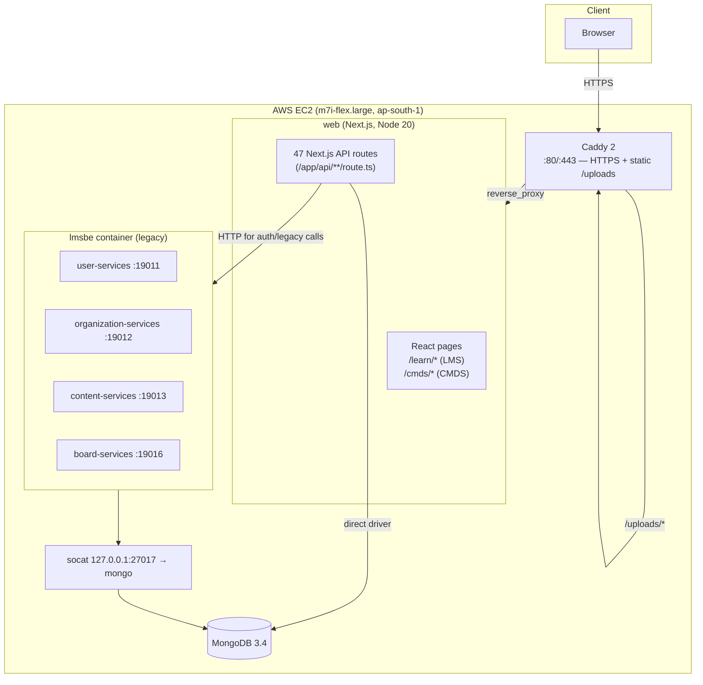

# UPrep — Architecture, Migration & Cloud-Deployment Document

_Last updated: 2026-07-05_

---

## 0. TL;DR — What's New vs Legacy, and Why Not Legacy

UPrep's legacy stack (`lms-master`, codename "zowie") is a fragile, 2013-era Play
Framework system — a Play 2.1 backend (needs Java 7 and only runs with JVM
bytecode verification disabled via `-Xverify:none`) plus a *separate* Play 1.2.4
UI, booted manually service-by-service with hard-coded `localhost`/`learnpedia.in`
hosts and locked to end-of-life MongoDB 3.4 — which is why it can't be lifted onto
AWS in any normal, scalable, supportable way. Instead, we kept the legacy backend
services running (containerized as `lmsbe`, with a `socat` shim so they still find
Mongo) but **replaced the entire legacy UI with a brand-new Next.js + React +
TypeScript app (`web`)** that delivers both the student LMS (`/learn/*`) and
admin CMDS (`/cmds/*`) through ~47 Next.js API routes talking directly to MongoDB
(and to legacy auth over HTTP), now deployed on a single AWS EC2 box behind Caddy
with automatic HTTPS. Separately, there's a forward-looking **nextgen
implementation (`backend`) — a modern Spring Boot 2.3 API-only rewrite
of the backend** that is the intended long-term replacement for the legacy Play
services (verified to build/run), so the end-state is the new Next.js UI on top of
the clean Spring Boot backend, fully retiring both the Play 2.1 services and the
Play 1.2.4 UI.

**In bullet points:**

- **What legacy is:** `lms-master` ("zowie") — a 2013-era Play Framework system.
  - Play 2.1 **backend** → needs **Java 7**, only runs with JVM verification off (`-Xverify:none`).
  - **Separate** Play 1.2.4 **UI** (a different framework generation).
  - Booted **manually, service-by-service**; hard-coded `localhost` / `learnpedia.in` hosts.
  - Locked to **end-of-life MongoDB 3.4**.
- **Why not legacy:** it can't be lifted onto AWS in any normal, scalable, or supportable way (old JVM, disabled safety checks, manual boot, hard-coded hosts, EOL DB).
- **What's new (deployed today):**
  - **Kept** the legacy backend services — containerized as **`lmsbe`**, with a **`socat` shim** so they still reach Mongo.
  - **Replaced the entire legacy UI** with a brand-new **Next.js + React + TypeScript** app (`web`).
    - Student **LMS** → `/learn/*`
    - Admin **CMDS** → `/cmds/*`
    - **~47 Next.js API routes** → talk directly to MongoDB (and to legacy auth over HTTP).
  - Deployed on a **single AWS EC2** box behind **Caddy** with **automatic HTTPS**.
- **What's next (long-term direction):**
  - **`backend`** = a modern **Spring Boot 2.3, API-only** rewrite of the backend (verified to build/run).
  - **End-state:** new Next.js UI on top of the clean Spring Boot backend — fully retiring **both** the Play 2.1 services **and** the Play 1.2.4 UI.

---

## 1. Executive Summary

UPrep is a Learning Management System (LMS) plus a Content Management & Delivery
System (CMDS) originally built on the **Vedantu/Learnpedia "zowie" legacy stack**
(`lms-master`). That legacy stack is a large, multi-service Play Framework
monolith-of-services designed for **on-premise / hand-provisioned Linux servers**
circa the early 2010s. It runs, but only under very specific, fragile conditions
(old JVMs, old framework binaries, manual per-service boot, hard-coded hosts and
ports). It is **not deployable to a modern cloud (AWS) as-is** without significant
rework — the reasons are detailed in Section 3.

To get UPrep running on AWS for demos and end-to-end testing **without rewriting
the legacy backend**, we took a pragmatic two-track approach:

1. **Kept the legacy backend services** (`user`, `organization`, `content`,
   `board`) running inside a Docker container (`lmsbe`) with the exact old
   toolchain they need — but containerized so it's reproducible.
2. **Replaced the legacy Play 1.2.4 UI apps** (`web-app`, `learn-app`,
   `cmds-app`) with a **brand-new Next.js application** (`web`) that talks to
   MongoDB directly and to the legacy services over HTTP. This is the UI that is
   actually deployed and used.

The result: a modern, single-container, HTTPS-served web app on AWS that
reproduces the legacy LMS **and** CMDS feature set, backed by the same MongoDB
data model, without touching the legacy source code.

**Bottom line for a decision-maker:**
- The legacy code is *preserved and runnable* (for reference / data-flow parity),
  but it is **not** what powers the cloud deployment.
- The cloud product is the **new Next.js UI** + **the legacy backend services** +
  **MongoDB**, orchestrated by Docker Compose behind Caddy (HTTPS).
- Everything is live on AWS today at a public `https://` URL.

---

## 2. Background — What the Legacy System Is

The legacy repo (`lms-master`, internal codename **zowie**) is a collection of
independent Play Framework applications, split into "commons / mgmt / services"
triplets per domain:

| Domain | Legacy modules | Role |
|---|---|---|
| User | `user-commons`, `user-mgmt`, `user-services` | Auth, users, sessions |
| Organization | `organization-commons/-mgmt/-services` | Institutes, members, org config |
| Content | `content-commons/-mgmt/-services` | Questions, tests, documents, videos |
| Board | `board-commons/-mgmt/-services` | Boards / exams / taxonomy |
| Billing, Comm, Event, Social, Viewer | … | Ancillary services |

The **backend services** are **Play 2.1.0** (Scala/Java, sbt). The **UI apps** —
`ui/web-app` (port **19001**), `ui/learn-app`, `ui/cmds-app` — are **Play 1.2.4**
(a completely different, older framework generation).

Service ports (from `lms-master/README.md`):

| Port | Service |
|---|---|
| 19001 | `web-app` (legacy Play 1.2.4 UI) |
| 19011 | `user-services` |
| 19012 | `organization-services` |
| 19013 | `content-services` |
| 19016 | `board-services` |

Data lives in **MongoDB** (legacy targets MongoDB 3.4).

---

## 3. Why the Legacy Stack Does **Not** Work on AWS (as-is)

This is the crux of the whole migration. The legacy stack was built for a
"pet server you SSH into and hand-configure," not for cloud/containers. Concrete
blockers we hit and why they're fundamental:

### 3.1 Ancient, incompatible runtimes
- **Backend = Play 2.1.0** (released ~2013). It requires an **old JDK (Java 7 /
  Zulu 7)** and an old sbt/Ivy toolchain. Modern AWS AMIs ship JDK 17/21; the app
  won't compile or run on them.
- **UI = Play 1.2.4** — a *different* framework generation with its own
  `play` binary (`/opt/play-1.2.4/play`), `dependencies.yml`, and module system.
  So the legacy product actually needs **two different Play frameworks + an old
  JVM** on the same box.

### 3.2 JVM bytecode verification failures
- On any non-ancient JVM, the legacy bytecode throws
  `java.lang.VerifyError: Inconsistent stackmap frames` / bytecode-verification
  errors. The only way we could run it at all was to disable verification:
  `JAVA_TOOL_OPTIONS="-Xverify:none"`. That's a red flag for production and is
  effectively impossible to "just run" on a standard cloud image.

### 3.3 Manual, order-dependent, per-service boot
- There is no single "start the app" command. Each service is started
  individually via bespoke scripts (`letsplay`, `startService.sh`,
  `restartContentServices.sh`, `vStart`, `vPlay.sh`) with per-service config
  strings like `"/usr/local/play-2.1.0;local;19013;.../logger.xml"`.
- The UI apps must be `play start`-ed separately again. Boot is fragile and
  order-dependent. Nothing about this maps onto a cloud autoscaling / immutable
  infrastructure model.

### 3.4 Hard-coded hosts, ports, and localhost assumptions
- Services assume peers are reachable at fixed `localhost:1901x` addresses, and
  MongoDB at `localhost:27017` (`local.conf`). In containers/cloud, "localhost"
  is per-container — so services can't find each other or the DB without network
  shims. We had to insert a **`socat` bridge** to fake `127.0.0.1:27017` inside
  the backend container's network namespace so the legacy services could reach the
  Mongo container. Config also carries hard-coded `learnpedia.in` hostnames
  (`WEB_APP_URL=http://…learnpedia.in:19001`), which don't resolve on AWS.

### 3.5 MongoDB version lock-in
- The data model targets **MongoDB 3.4** (EOL). Managed cloud databases (Atlas /
  DocumentDB) won't run 3.4. So we pin `mongo:3.4` in a container — usable for a
  demo, but not a supported managed cloud DB path.

### 3.6 macOS / packaging fragility
- The source tarball carried macOS AppleDouble metadata (`._*`, `.DS_Store`).
  sbt tried to parse `._plugins.sbt` as Scala and crashed ("illegal character").
  We had to strip these before services would start — symptomatic of how
  environment-sensitive the build is.

### 3.7 Net effect
> The legacy stack can be *coaxed* into running inside a carefully constructed
> Docker container that reproduces its 2013-era environment, but it **cannot be
> deployed to AWS in any normal, supportable, cloud-native way**. It is not
> horizontally scalable, not health-checkable, not config-driven, and depends on
> disabled JVM safety checks. That is why the UI was rebuilt rather than lifted
> and shifted.

---

## 4. What We Built Instead — New Architecture

### 4.1 High-level

### 4.2 The new UI (`web`)
- **Stack:** Next.js (App Router) + React + TypeScript + Tailwind CSS, Node 20.
- **Two products, one app** (mirrors legacy split):
  - **LMS (student-facing):** `app/learn/*` — library, programs, tests/exam,
    assignments, leaderboard, messages, doubts, playlists, certificates,
    challenges, news, notifications, bookmarks, activity, analytics, profile,
    search.
  - **CMDS (admin/authoring):** `app/cmds/*` — question authoring (SCQ, MCQ,
    NUMERIC, SUBJECTIVE, MATRIX, PARA), tests + rules, papers, programs,
    documents/videos with folders, assignments, and admin **Tools** (people,
    academic structure, schedule, exports, signup config, referrals, news,
    boards, channels, devices, notifications, organization).
- **Backend-for-frontend:** **47 Next.js API routes** under `app/api/**/route.ts`
  act as the server layer. Two integration modes:
  1. **Direct MongoDB** via the official Node driver (`lib/mongo.ts`) — used for
     most reads/writes because the corresponding legacy service endpoints are not
     all runnable.
  2. **HTTP to legacy services** (`lib/config.ts` → `USER_SERVICE_URL`, etc.) —
     used where the legacy logic matters (e.g. `authenticateUser`).
- **Shared libs (`web/lib/`):** `mongo.ts` (connection), `session.ts`
  (`UprepSession` in `sessionStorage`), `storage.ts` (disk uploads to
  `public/uploads`), `config.ts` (service URLs + default org id).
- **Rendering niceties:** KaTeX for math in questions/solutions/tests.

### 4.3 Legacy backend, containerized (`lmsbe`)
- The legacy **backend** services are kept and run inside an image
  (`uprep-lmsbe:aws`) that reproduces the old toolchain, started by
  `deploy/entrypoint.sh` with `-Xverify:none`.
- `socat` provides `127.0.0.1:27017` inside `lmsbe`'s netns → forwards to the
  `mongo` container, satisfying the legacy `localhost:27017` assumption.

### 4.4 Legacy UI (`lmsui`) — reference only
- The legacy Play 1.2.4 UI apps (incl. `web-app` on **19001**) run in a separate
  `lmsui` container (`/opt/play-1.2.4`), mounting `lms-master`. This is used
  **locally for reference/parity checks only** — it is **not** part of the AWS
  deployment.

---

## 5. Detailed Changes vs Legacy (Component Mapping)

| Concern | Legacy (`lms-master`) | New (`web` + deploy) | Why changed |
|---|---|---|---|
| Student UI | `ui/learn-app` (Play 1.2.4) | `app/learn/*` (Next.js) | Play 1.2.4 not cloud-deployable |
| Admin UI | `ui/cmds-app` (Play 1.2.4) | `app/cmds/*` (Next.js) | same |
| Marketing site | `web-app` / `learnpedia.in` | Next.js marketing pages (`/`, `/about`, …) | rebuilt to match look/feel |
| Server logic | Play controllers | 47 Next.js API routes | new BFF layer |
| Auth | `user-services/authenticateUser` | `api/auth/login` → calls legacy `authenticateUser` | reused legacy auth |
| Data access | Play models → Mongo | Node Mongo driver (`lib/mongo.ts`) direct + service HTTP | legacy services not all runnable |
| File uploads | legacy content service | `api/cmds/upload` → disk (`public/uploads`), Caddy serves them | see §6.2 |
| Config | per-service `.conf`, hard-coded hosts | env vars in `docker-compose.yml` | cloud-friendly |
| Boot | manual `letsplay`/`startService.sh` per service | `docker compose up` | reproducible |
| TLS / routing | none / manual | **Caddy** (auto Let's Encrypt) | HTTPS on AWS |
| DNS | `learnpedia.in` | `*.sslip.io` (IP-based instant DNS) | no domain purchase needed |

### 5.1 Notable code-level changes (with reasons)
- `app/api/auth/signup/route.ts` — self-signup writes an `orgmembers` doc with a
  **unique placeholder** `userId: SELF_<ObjectId>` (not `null`). The collection
  has a unique index on `(orgId, userId)`; multiple `null`s collided with
  `E11000 duplicate key`.
- `app/api/learn/certificates/route.ts` — reads from **`orgprograms`** (the
  populated collection) instead of the empty `programs` collection.
- `app/api/cmds/upload/route.ts` + `components/CmdsUploadForm.tsx` +
  `app/cmds/page.tsx` — thread a **`folderId`** through the upload flow so files
  land in the folder the user is in (was previously always dropped at root).
- `next.config.mjs` — `eslint.ignoreDuringBuilds` + `typescript.ignoreBuildErrors`
  so strict lint/type checks don't block the demo build.
- `package.json` — added missing `katex` dependency (build failed without it).

---

## 6. Runtime / Deployment Architecture (AWS)

### 6.1 Infrastructure
- **Compute:** AWS EC2 `m7i-flex.large` (2 vCPU, 8 GB), `ap-south-1`.
  (Chosen because a brand-new "Free Plan" account restricts non-free-tier
  instance types like `t3.large`; `m7i-flex.large` is free-tier eligible and
  sufficient.)
- **Networking:** Elastic IP (static), Security Group (22 / 80 / 443).
- **DNS + TLS:** `65-2-108-70.sslip.io`-style hostname (resolves to the EIP with
  no registration), **Caddy** terminates HTTPS via Let's Encrypt and redirects
  HTTP→HTTPS.
- **Swap:** 4 GB swap added to survive the Next.js build memory spike alongside
  the JVM services.

### 6.2 Docker Compose services (`deploy/docker-compose.yml`)
| Service | Image | Role |
|---|---|---|
| `mongo` | `mongo:3.4` | Database (legacy-compatible) |
| `lmsbe` | `uprep-lmsbe:aws` | Legacy Play 2.1 services (`-Xverify:none`) |
| `socat` | `alpine/socat` | Bridges `127.0.0.1:27017` → `mongo` inside lmsbe netns |
| `ui` | `node:20-bullseye` | Builds & serves `web` on :3000 |
| `caddy` | `caddy:2` | HTTPS reverse proxy + serves `/uploads/*` from disk |

Key env wiring for `ui`: `MONGO_URI=mongodb://mongo:27017`,
`MONGO_DB=localvedantu`, `USER_SERVICE_URL=http://lmsbe:19011`,
`ORG_SERVICE_URL=http://lmsbe:19012`, `CONTENT_SERVICE_URL=http://lmsbe:19013`,
`BOARD_SERVICE_URL=http://lmsbe:19016`.

**Why Caddy serves uploads directly:** Next.js `next start` only serves files that
existed in `public/` at **build time**. Files uploaded *after* the build (into
`public/uploads`) returned 404. Caddy bind-mounts that directory and serves
`/uploads/*` straight from disk, bypassing Next.js.

**Why Node 20 (not 18):** the upload route uses the `File` web global, which is
only defined in Node 20+.

---

## 7. Data Model (MongoDB `localvedantu`)

The new UI reuses the legacy MongoDB collections and adds a few of its own.
Representative collections:

- **Identity / org:** `orgmembers`, `orgprograms`, `orgdepartments`,
  `orgcenters`, `orgsections`, `signupconfigs`, `referrals`.
- **Content / assessment:** `cmdsquestions`, tests, `assignments`, `submissions`,
  `documents`, `videos`, `playlists`, `programs`/`orgprograms`, `challenges`.
- **Engagement:** `userentityattempts`, `messages`, `news`, `schedules`,
  `exports`.

Conventions: Mongo `ObjectId`s are converted to strings at the API boundary for
consistency in the UI.

> **Important semantic caveat:** public **self-signup creates only an
> `orgmembers` entity** (with placeholder `userId: SELF_…`). It does **not** yet
> create a login-capable user account in `user-services`. Making a signup able to
> log in requires the legacy user-creation/activation flow (one reason the legacy
> `web-app` on 19001 was booted for reference).

---

## 8. Feature Parity Snapshot

- **LMS:** library, programs, test-taking/exam engine (KaTeX), grading,
  assignments, leaderboard, messaging (polling), doubts, playlists, certificates,
  challenges, news, notifications, bookmarks, activity, analytics, profile,
  search — implemented in `app/learn/*`.
- **CMDS:** multi-type question authoring, test creation with rules
  (password/partial-marks/section-lock/auto-resume/result-visibility), publishing,
  papers, programs + marksheets, document/video uploads with folders, assignments,
  and the admin **Tools** suite (people, academic, schedule, exports, signup,
  referrals, news, boards, channels, devices, notifications, organization).
- **Marketing:** `learnpedia.in`-style pages rebuilt in Next.js.

---

## 9. Known Limitations & Caveats

1. **Not cloud-native, still demo-grade.** The legacy backend runs with JVM
   verification disabled inside a pinned container. Fine for demos/tests; not a
   supportable production posture.
2. **MongoDB 3.4** is EOL and container-pinned — no managed DB (Atlas/DocumentDB)
   path without a data-model upgrade.
3. **Self-signup ≠ login account** (see §7). Needs an activation/user-creation
   step to be truly end-to-end.
4. **Some legacy service endpoints are not all runnable**, so many flows read/write
   Mongo directly from the Next.js API layer rather than via the legacy services.
5. **Build strictness disabled** (`ignoreDuringBuilds` / `ignoreBuildErrors`) to
   keep the demo build green — should be re-enabled and errors fixed for prod.
6. **Uploads are on local disk** served by Caddy — not durable/replicated; a real
   deployment would use S3 + CDN.
7. **SSH temporarily opened to 0.0.0.0/0** during deployment (key-only auth) to
   work around rotating egress IPs — should be tightened.

---

## 10. Recommended Path to a Real Production Deployment

| Area | Demo (today) | Production target |
|---|---|---|
| Backend | Legacy Play in pinned container, `-Xverify:none` | Reimplement remaining logic as services on a supported JVM, or complete `lms_nextgen` (Spring Boot) |
| Database | `mongo:3.4` container | Managed MongoDB (Atlas) on a supported version after schema validation |
| Uploads | Local disk + Caddy | S3 + CloudFront |
| DNS/TLS | `sslip.io` + Caddy | Real domain + ACM/Caddy, WAF |
| Compute | Single EC2 + Compose | ECS/EKS or ASG, health checks, autoscaling |
| Secrets/config | env in compose | SSM Parameter Store / Secrets Manager |
| Access | SSH 0.0.0.0/0 (temp) | SSM Session Manager, no public SSH |
| Build | lint/types ignored | strict CI, image scanning |

---

## Appendix A — Key Paths
- New UI: `web/` (pages `app/learn/*`, `app/cmds/*`; APIs `app/api/**/route.ts`; libs `lib/*`).
- Deploy: `deploy/docker-compose.yml`, `deploy/Caddyfile`, `deploy/entrypoint.sh`.
- Legacy: `lms-master/` (`user|organization|content|board/*-services`, `ui/web-app|learn-app|cmds-app`).
- Next-gen backend (WIP, Spring Boot): `backend/`.

## Appendix B — Port Reference
| Port | What |
|---|---|
| 80/443 | Caddy (public HTTPS) |
| 3000 | Next.js `ui` (internal) |
| 19001 | Legacy `web-app` (local `lmsui` reference only) |
| 19011 / 19012 / 19013 / 19016 | user / organization / content / board services |
| 27017 | MongoDB |
