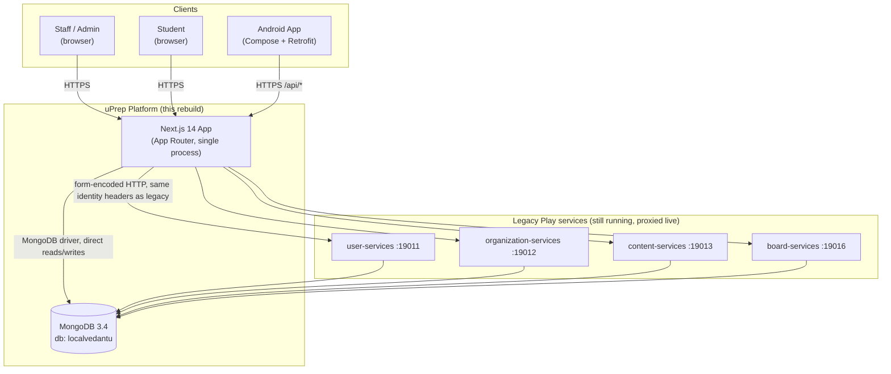
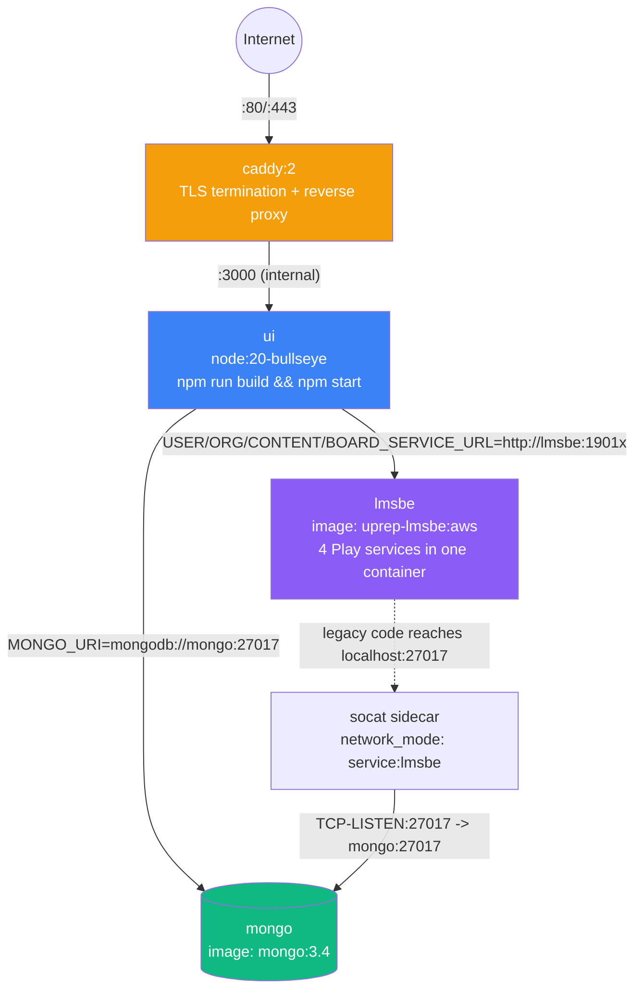
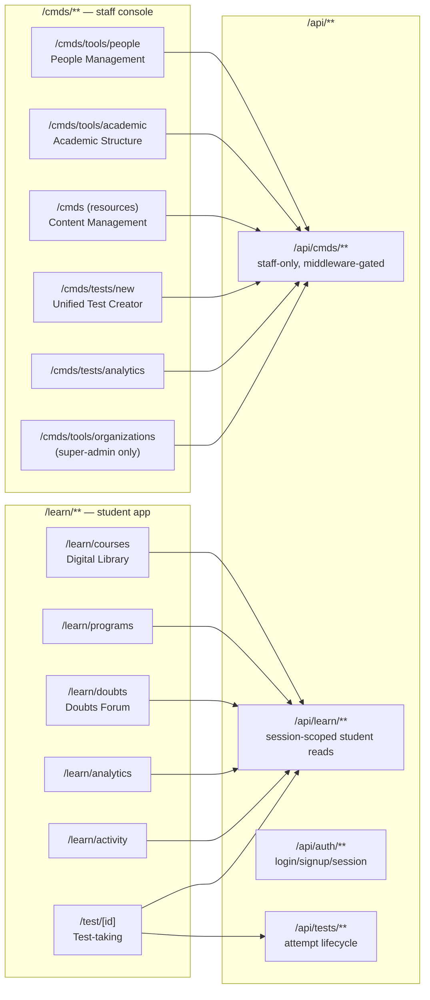
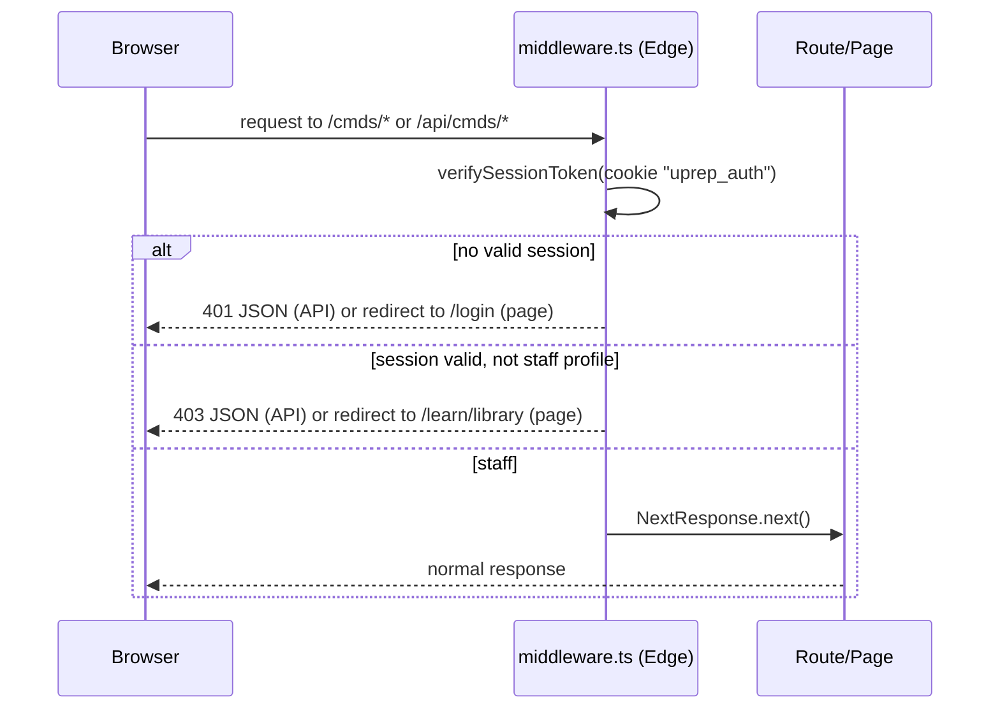
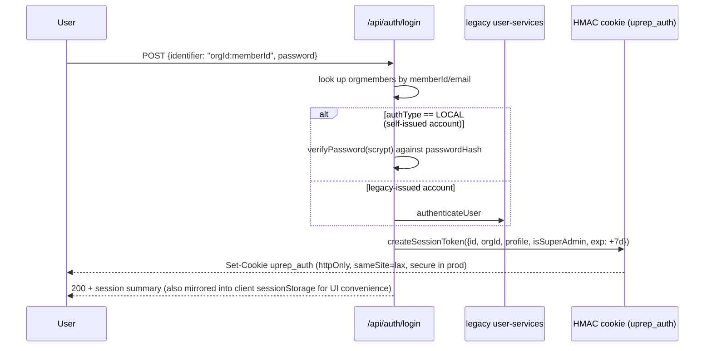
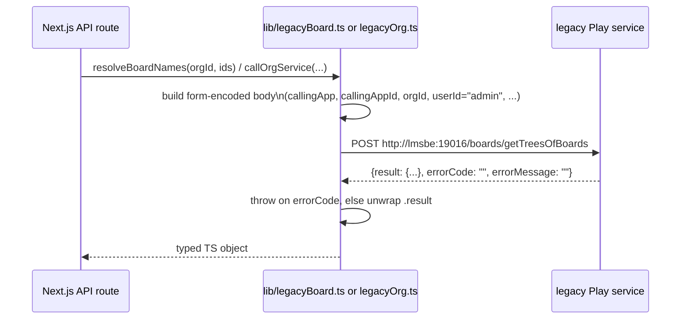
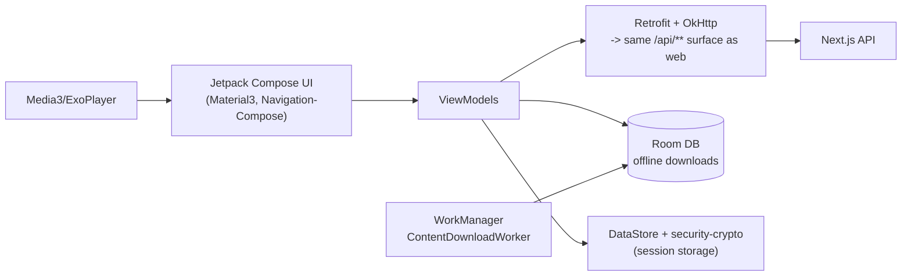

# uPrep Platform — Architecture Deep Dive

| | |
|---|---|
| **Status** | Verified against live source + running production deployment |
| **Scope** | `platform/web` (Next.js app), `platform/mobile/android` (native app), `platform/deploy` (infra), legacy `lms-master` monorepo (proxied services) |
| **Verification method** | Direct source reads, live grep/counts against the repository, live queries against the production MongoDB and legacy services over SSH. No claim below is from memory alone — see the "Evidence" note under each numbered fact. |
| **Not verified** | Legacy modules `billing/`, `comm/`, `social/`, `event/`, `viewer/`, and `cmds/cmds-services` exist in source but are **not started** by the current deployment and **not called** by the rebuild (confirmed by absence from `entrypoint.sh` and `lib/config.ts`). This document does not describe their internal behavior — only that they exist and are currently dormant. |

---

## 1. What this system is

uPrep is a B2B SaaS platform for test-prep coaching institutes (JEE/NEET-style exam prep). It has two audiences sharing one backend:

- **Staff/Admins** — run a coaching institute's back office: enroll students, build question banks, assemble tests, manage content, view analytics. ("CMDS" = Content Management & Distribution System, the legacy product name, kept in this rebuild.)
- **Students** — consume content (videos, e-books, tests), take tests, ask doubts, track their own progress.

It is a **multi-tenant** system: every document in the database is scoped to an `orgId` (one coaching institute = one org), and a super-admin role can operate across orgs (granting content between institutes, creating new institutes).

## 2. Context diagram



**Evidence:** `lib/config.ts` (the four service URLs + Mongo URI), `platform/deploy/entrypoint.sh` (starts exactly these four Play services, on exactly these ports, and no others).

## 3. Architectural patterns in use

These are the patterns actually implemented, not aspirational:

| Pattern | Where | Why |
|---|---|---|
| **Strangler Fig** | The whole rebuild | The two legacy front-door web apps (`ui/cmds-app`, `ui/learn-app` — Play + server-rendered templates) are being replaced by the Next.js app one feature at a time, while the underlying legacy *data* services (user/org/content/board) keep running and are called over HTTP for the parts not yet natively reimplemented. |
| **Backend-for-Frontend (BFF)** | `app/api/**` (92 route handlers) | Next.js API routes are the only backend the browser/Android app talk to. They either read Mongo directly or fan out to legacy services, and shape the response for exactly what the UI needs — the client never talks to Mongo or the legacy services directly. |
| **Adapter / Anti-Corruption Layer** | `lib/legacyOrg.ts`, `lib/legacyBoard.ts` | Each wraps one legacy service's form-encoded, Java-DTO-shaped protocol behind a small typed TypeScript function, so the rest of the app never constructs legacy request payloads by hand. |
| **Edge-gated RBAC** | `middleware.ts` | A single middleware function gates every `/cmds/**` page and `/api/cmds/**` call on one condition (staff profile), mirroring legacy's `Security.checkAccess()` `@Before` interceptor — but running at the edge, before any page code executes. |
| **Signed, stateless session token** | `lib/auth-session.ts` | HMAC-SHA256-signed cookie carrying identity + org + role, verified with Web Crypto (works identically in the Node route runtime and the Edge middleware runtime). No server-side session store. |
| **Direct data access, no ORM** | Every route under `app/api/**` | The MongoDB driver is used directly (`db.collection("x").find(...)`) — there is no ORM/repository layer. Collections and their shapes are the closest thing to a schema this system has. |
| **Multi-tenancy via row/tenant scoping** | `lib/org-scope.ts`, every collection's `orgId`/`contentSrc.id` field | Not database-per-tenant or schema-per-tenant — every document carries its owning org, and `resolveOrgId()` pins a normal admin to their own org while allowing a super-admin to override it. |

## 4. Deployment architecture



**Evidence:** `platform/deploy/docker-compose.yml` (read in full), `platform/deploy/entrypoint.sh`.

Facts worth calling out explicitly (all directly from the compose file):

1. **Single host, single docker-compose stack** — five containers (`mongo`, `lmsbe`, `socat`, `ui`, `caddy`) on one bridge network (`lmsnet`), no orchestrator, no horizontal scaling.
2. **`ui` builds itself on container start** — the command is literally `npm install && npm run build && npm start`, not a pre-built image. There is no CI pipeline building a versioned artifact; a deploy is "sync source, recreate container, it rebuilds itself."
3. **`lmsbe` is one container running four independent legacy JVM services** (ports 19011/19012/19013/19016) via `sbt start <port>` per service, not four separate containers.
4. **The `socat` sidecar exists purely because legacy `local.conf` hardcodes `localhost:27017`** — it shares `lmsbe`'s network namespace and forwards `127.0.0.1:27017` to the real `mongo` service, so the legacy JVM code doesn't need to be touched to reach a container-networked Mongo.
5. **MongoDB is version 3.4** (confirmed live: `db.version()` → `3.4.24`), matching the `mongo:3.4` image pin — this is a legacy-mandated floor, not a current choice (see §11, Risks).
6. **The actual deploy mechanism** (observed and executed repeatedly in this project) is: `rsync` the `platform/web` source tree to the host, then `docker compose up -d --force-recreate ui`, which re-runs the build-and-start command above. There is no blue/green or rolling deploy — the container restarts with a brief gap.

## 5. Application architecture (the Next.js app)

**Evidence:** direct `find`/`wc -l` counts against `platform/web`, `package.json`.

| Metric | Count |
|---|---|
| Page routes (`page.tsx`) | 74 |
| API route handlers (`route.ts`) | 92 |
| — under `/cmds/**` (staff) | 39 pages |
| — under `/learn/**` (student) | 23 pages |
| Shared domain modules (`lib/*.ts`) | 21 |
| Shared UI components (`components/*.tsx`) | 10 |
| TypeScript/TSX lines of code | ~34,200 |

### 5.1 Route-space split



### 5.2 The `lib/` layer (closest thing to a service/domain layer)

There is no formal service-layer abstraction, but `lib/` consistently plays that role. The load-bearing modules, by responsibility:

- **Identity & access:** `auth-session.ts` (token sign/verify), `server-session.ts` (cookie → payload for route handlers), `session.ts` (client-side `sessionStorage` mirror, *not* trusted for authorization), `roles.ts` (`isStaff`, `isSuperAdmin`, `canManageContent`), `org-scope.ts` (`resolveOrgId`).
- **Content graph:** `courses.ts` (folder-tree traversal: `loadOrgFolders`, `collectSubtreeIds`, natural-sort helpers), `legacyBoard.ts` (Board Tree proxy + the two-hop chapter→subject resolver built this session, `resolveBoardSubjects`), `enrollment.ts` (`resolveStudentEnrollment` — the 3-way access union described in §7.3; `resolveAllProgramGroups` for staff preview).
- **Legacy adapters:** `legacyOrg.ts`, `legacyBoard.ts` — one per proxied legacy service, each owning that service's request-shape quirks (form-encoding, array-index field names, `{result, errorCode, errorMessage}` envelope).
- **Cross-cutting:** `mongo.ts` (single cached `MongoClient`/`getDb()`), `grants.ts` (cross-org content grants), `commerce.ts`, `messaging.ts`, `sections.ts`, `password.ts` (scrypt, self-contained — not delegating to legacy auth), `testCode.ts`, `subjectColors.ts` (pure presentation), `video.ts`, `storage.ts`, `login-log.ts`.

### 5.3 Middleware-based access gate



One explicit, deliberate exception: `GET /api/cmds/tools/news` is public (student News page reads institute announcements through the same endpoint) — `isPublicRead()` in `middleware.ts`.

**Evidence:** `middleware.ts` read in full.

## 6. Authentication & session model



Two independent password paths coexist (**verified in `app/api/auth/login/route.ts` and `lib/password.ts`**):

1. **Locally-created accounts** (students/teachers added via CMDS, or self-signups) — password hashed with `scrypt`, stored as `orgmembers.passwordHash`, format `scrypt$<saltHex>$<hashHex>`. This is a genuinely new capability the legacy stack didn't need, since legacy always owned auth.
2. **Legacy-issued accounts** — authenticated by proxying to `user-services`' `authenticateUser`.

The session token itself (`lib/auth-session.ts`) is a from-scratch addition this rebuild needed and legacy didn't: legacy ran one Play process with server-side sessions; this rebuild's middleware runs on the Edge runtime, which cannot share in-process state with the Node route runtime, so identity has to travel *in* the request as a signed, stateless token. Falls back to a **hardcoded dev secret** if `SESSION_SECRET` is unset (flagged in §11).

## 7. Data architecture

**Evidence:** `grep`-derived list of every `.collection("...")` call across `app/` and `lib/` (36 distinct collections found), plus live schema reads against the production database performed during this project.

### 7.1 Collection inventory, grouped by domain

| Domain | Collections |
|---|---|
| Identity & Org | `orgmembers`, `organizations`, `orgprograms`, `orgcenters`, `orgsections`, `logins` |
| Content authoring (draft) | `cmdsquestions`, `cmdstests`, `cmdsmodules` |
| Content (published/library) | `questions`, `tests`, `modules`, `videos`, `documents`, `questionsets`, `folders` |
| Testing & assessment | `userentityattempts`, `userquestionattempts`, `marksheets` |
| Engagement / social | `discussions` (doubts), `answers`, `comments`, `bookmarks`, `playlists`, `challenges`, `channels`, `reviews` |
| Comms | `messages`, `orgnotifications`, `news`, `schedules` |
| Commerce | `coupons`, `invoices`, `submissions`, `enquiries`, `referrals` |
| Ops | `exports`, `signupconfigs` |

Note: `folders` is the **content/course tree**; the **Board Tree** (subject → chapter → concept, used for tagging questions and doubts) is *not* a local collection at all — it is owned entirely by the live `board-services` legacy process and reached only over HTTP (§9.4). These are two structurally independent hierarchies that happen to share similar top-level names ("Physics XI" as both a folder and a board node with different, unrelated `_id`s).

### 7.2 Core entity relationships

```mermaid
erDiagram
    ORGANIZATION ||--o{ ORGMEMBER : "has"
    ORGANIZATION ||--o{ ORGPROGRAM : "defines"
    ORGPROGRAM ||--o{ ORGSECTION : "has batches"
    ORGMEMBER }o--o{ ORGPROGRAM : "programMemberships[]"
    ORGPROGRAM ||--o{ FOLDER : "courseIds[] grants"
    ORGSECTION ||--o{ FOLDER : "courseIds[] grants (often the real source of truth)"
    FOLDER ||--o{ FOLDER : "parentId (chapter tree)"
    FOLDER ||--o{ VIDEO : contains
    FOLDER ||--o{ DOCUMENT : contains
    FOLDER ||--o{ TEST : contains
    TEST ||--o{ USERENTITYATTEMPT : "attempted via entity.id"
    USERENTITYATTEMPT ||--o{ USERQUESTIONATTEMPT : "attemptId"
    QUESTION }o--o{ TEST : "referenced by metadata[].details[].qIds"
    ORGMEMBER ||--o{ USERENTITYATTEMPT : "userId"
```



### 7.3 A worked example: how "what can this student see" is actually computed

This is the single most-touched piece of business logic in the rebuild, and it is a **union of three independent grants**, not a simple foreign key (`lib/enrollment.ts`, function `resolveStudentEnrollment`):

1. `orgmembers.enrolledCourseIds` — a direct, manual override (set by an admin via Assign Courses, or by a checkout/coupon/enroll-code flow).
2. `orgprograms.courseIds` — whatever the student's Program grants.
3. `orgsections.courseIds` — a finer override on top of the Program (in real production data, the Program's own `courseIds` is often empty and the *Section* carries the real list — discovered by inspecting live data, not assumed).

The union of these three, filtered down to the org's actual course catalog (`resolveCourseCatalog`, which also folds in cross-org grants — `lib/grants.ts`), is the student's enrolled-course root set. Every other student-facing surface (Digital Library, `/api/library`, test access checks) is required to call this same function rather than re-deriving access, specifically because two independent reimplementations of this logic drifted out of sync earlier in the project.

### 7.4 Test document shape

A `tests`/`cmdstests` document's `metadata` array is a list of **physical sections**; each section's `details` array can mix multiple question types with **independently configurable marks per type within the same section** — confirmed by inspecting a real production test document, not assumed from a naive "one section = one type" model. The JSON below is a simplified, illustrative reconstruction of that shape (field names and nesting are real; the specific values are made up for readability, not copied from a specific document):

```json
{
  "name": "Weekly Physics Test",
  "metadata": [
    {
      "name": "Section 1",
      "details": [
        { "type": "SCQ", "qusCount": 10, "marks": { "1": { "positive": 4, "negative": -1 } } },
        { "type": "NUMERIC", "qusCount": 5, "marks": { "2": { "positive": 4, "negative": 0 } } }
      ]
    }
  ],
  "totalMarks": 60,
  "resultVisibility": "VISIBLE"
}
```

## 8. Integration architecture — calling the legacy services



Four legacy services are proxied today; each has one narrow, specific purpose in the rebuild (not "everything that service offers" — only what's been wired up):

| Service | Port | What the rebuild actually calls it for |
|---|---|---|
| `board-services` | 19016 | The Board Tree (subject/chapter/concept nodes used to tag questions/doubts): `getChildren` (tree walk), `getTreesOfBoards` (batch name resolution, including the chapter→subject two-hop resolver built this session). |
| `content-services` | 19013 | Test detail + questions for the actual test-taking screen: `getTestInfo`, `getTestQuestions` (kept server-authoritative so answer keys never reach the client unfiltered). |
| `organization-services` | 19012 | Academic Structure CRUD end-to-end: `getOrganization`, `getDepartments`/`addDepartment`/`removeDepartment`, `getPrograms`/`addProgram`/`removeProgram`, `getCenters`/`addCenter`/`removeCenter`, `getProgramCenters`/`addProgramCenters`/`removeProgramCenters`, `getSections`/`addSection`/`removeSection` (`lib/legacyOrg.ts` — full action list confirmed by grep, not partial). |
| `user-services` | 19011 | Legacy-issued-account authentication fallback in the login route. |

## 9. Key subsystems

### 9.1 CMDS (staff console)

People Management (with a CSV bulk-import flow that auto-generates Institute IDs and passwords), Academic Structure (Departments → Programs → Centers → Sections, plus a Courses tab for assigning content), Content Resources (question bank, tests, modules — draft in `cmds*` collections, promoted to the published collections on publish), a **unified** Create Test flow (manual pick or auto-generate share one Setup → Subjects & Types → Chapters flow, forking only on an `autoGenerateFlag`-equivalent mode toggle — this mirrors legacy's real `QrTests.createTest()`/`createTestAuto()` structure, which this rebuild originally got wrong by building two separate top-level pages before being corrected against legacy source), an Instant Test Generator (multi-subject, multi-chapter, difficulty-split auto-generation with per-question Replace), Test Analytics, and Organizations (super-admin only: create orgs, grant content across orgs).

### 9.2 Student app

Digital Library (subject cards grouped strictly by Program — by explicit product decision, there is no "ungrouped/Other Courses" concept), Programs, Doubts Forum, Recent Activity, and a per-student Analytics page built this session: accuracy by subject (resolved through the real board-tree hierarchy, not a hardcoded mapping) and by question type, a score trend, and derived strengths/focus-areas — none of which exist in the legacy product at all (§ see comparison document).

### 9.3 Test-taking engine

One attempt per test, permanently — this is not a rebuild policy choice, it is a **discovered legacy business rule** (`AnalyticsManager.isMultiAttemptAllowed()` is hardcoded `return false` in legacy source). The rebuild surfaces this up front (`alreadyAttempted` flag on `GET /api/tests/[id]`) rather than letting a student redo a test and hit a silent grading failure, which is what an earlier, unverified version of this rebuild did.

### 9.4 Content model — two parallel trees

The **Folder tree** (`folders` collection, local) organizes *browsable content* (Program → Subject folder → Chapter folder → videos/documents/tests). The **Board Tree** (owned by `board-services`, remote) organizes *tagging metadata* for questions and doubts (Subject → Chapter → Concept). They are not the same tree, do not share IDs, and are reconciled only by a best-effort name-normalization heuristic where the UI needs to bridge them (documented in `app/cmds/tools/academic/page.tsx`'s `normSubjectName`, which the code itself notes matched 85–100% of real chapters against production data, not 100%).

## 10. Mobile architecture



**Evidence:** `app/build.gradle.kts` dependency list, file inventory (27 Kotlin files) including `DownloadDao`, `DownloadDatabase`, `DownloadEntity`, `ContentDownloadWorker`, `DownloadRepository`, `OfflineAuth`, `DownloadsScreen`, `DocumentViewerScreen` — i.e. this has moved past "WebView shell" (the README's documented original design) into native screens with offline content download, though the README itself has not been re-verified as updated to reflect this.

## 11. Known risks / limitations (stated plainly, not softened)

1. **MongoDB 3.4.24** is years past end-of-life upstream; the version floor exists because the legacy JVM driver/queries assume 3.x wire behavior, not because it was chosen.
2. **Single VM, no redundancy** — `mongo`, `lmsbe`, and `ui` are one container each on one host; any one of them going down takes the whole platform down, and a deploy briefly stops the `ui` container.
3. **Self-building container** — the `ui` service runs `npm install && npm run build` on every start; there is no immutable, pre-tested build artifact being promoted through environments.
4. **`SESSION_SECRET` has a hardcoded fallback** (`lib/auth-session.ts`) if the env var isn't set — acceptable for the current single-env deployment, a real risk if ever multi-environment.
5. **No automated test suite found** in `platform/web` (verification throughout this project has been `npm run build` type-checking plus manual/live-data verification, not unit/integration tests).
6. **Runtime coupling to legacy** — four legacy Play services must be up for board-tree browsing, test-taking, and some org lookups to work at all; there is no fallback path if `lmsbe` is down.
7. **Two independent content hierarchies** (§9.4) reconciled by name-matching, not by ID — a real long-term data-integrity risk if names diverge further.

## 12. Appendix — verified counts

| Item | Count | Source |
|---|---|---|
| Next.js page routes | 74 | `find app -name page.tsx \| wc -l` |
| Next.js API routes | 92 | `find app/api -name route.ts \| wc -l` |
| `lib/` modules | 21 | `ls lib/*.ts` |
| Mongo collections referenced | 36 | grep across `app/`, `lib/` |
| Web app TS/TSX LOC | ~34,200 | `wc -l` |
| Legacy Java files (whole monorepo) | 2,244 | `find legacy -name '*.java' \| wc -l` |
| Android Kotlin files | 27 | `find ... -name '*.kt' \| wc -l` |
| Legacy top-level domain modules | 12 (`billing`, `board`, `cmds`, `comm`, `commons`, `content`, `event`, `organization`, `social`, `static-resources`, `ui`, `user`, `viewer`) | repo directory listing |
| Legacy services actually running in production | 4 of those 12+ domains (`user`, `organization`, `content`, `board`) | `entrypoint.sh` |
