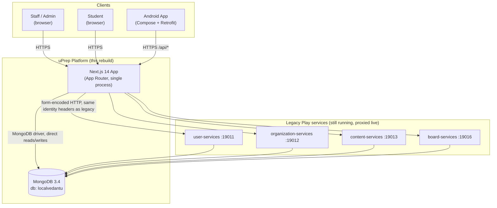
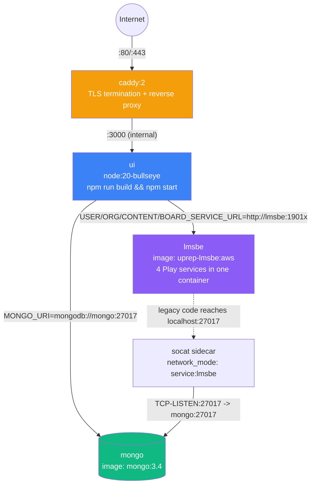
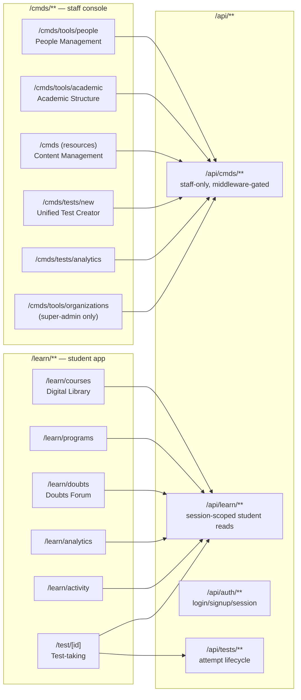
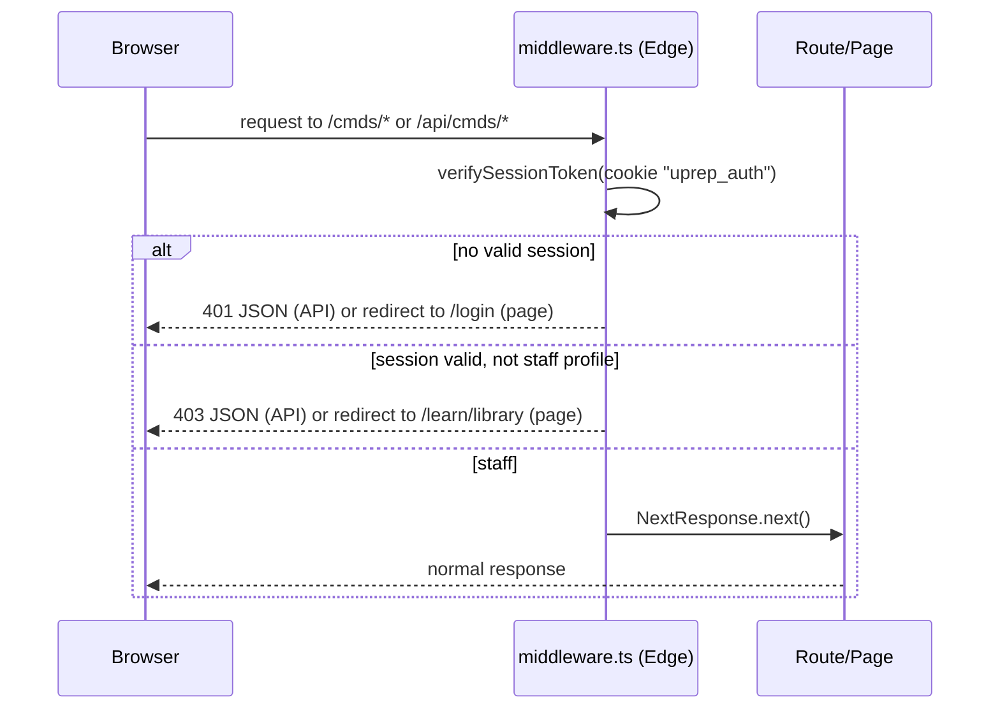
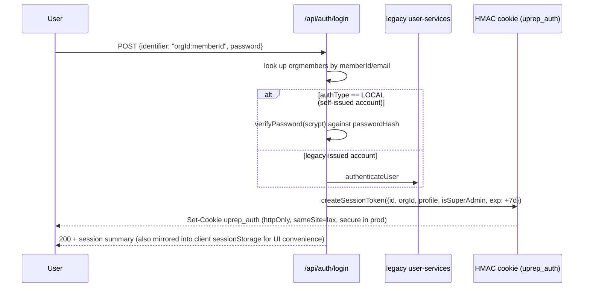
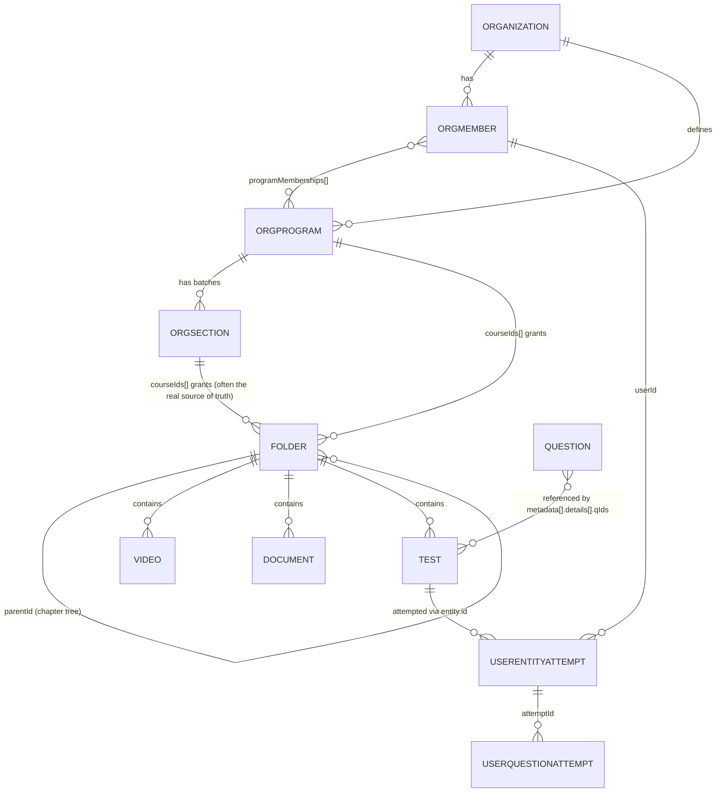
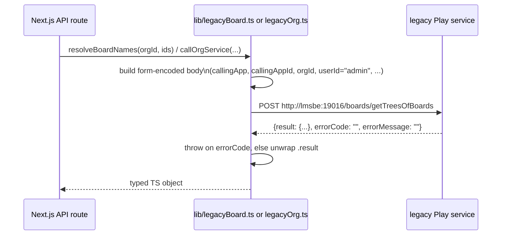
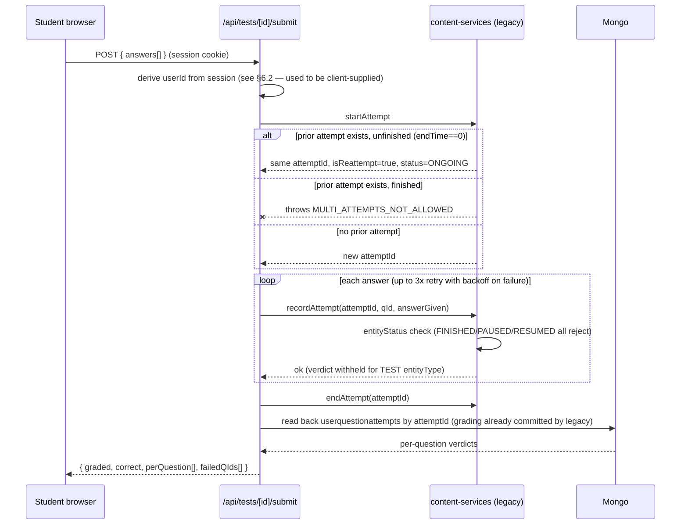
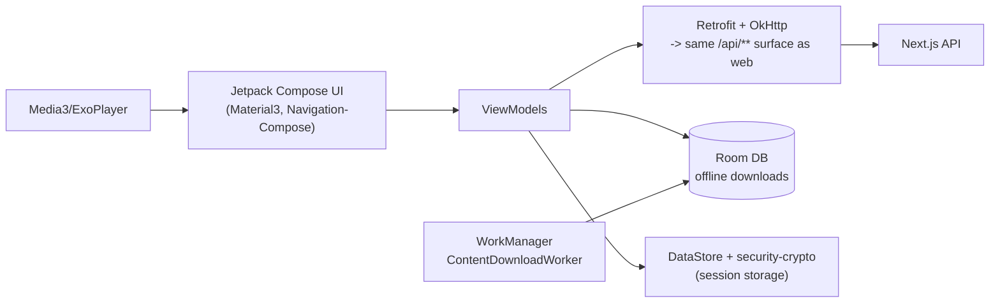

# uPrep Platform — Architecture Deep Dive

| | |
|---|---|
| **Status** | Verified against live source + running production deployment |
| **Scope** | `platform/web` (Next.js app), `platform/mobile/android` (native app), `platform/deploy` (infra), legacy `lms-master` monorepo (proxied services) |
| **Verification method** | Direct source reads, live grep/counts against the repository, live queries against the production MongoDB and legacy services over SSH. No claim below is from memory alone — see the "Evidence" note under each numbered fact. |
| **Not verified** | Legacy modules `billing/`, `comm/`, `social/`, `event/`, `viewer/`, and `cmds/cmds-services` exist in source but are **not started** by the current deployment and **not called** by the rebuild (confirmed by absence from `entrypoint.sh` and `lib/config.ts`). This document does not describe their internal behavior — only that they exist and are currently dormant. |

---

## 1. What this system is

uPrep is a B2B SaaS platform for test-prep coaching institutes (JEE/NEET-style exam prep). It has two audiences sharing one backend:

- **Staff/Admins** — run a coaching institute's back office: enroll students, build question banks, assemble tests, manage content, view analytics. ("CMDS" = Content Management & Distribution System, the legacy product name, kept in this rebuild.)
- **Students** — consume content (videos, e-books, tests), take tests, ask doubts, track their own progress.

It is a **multi-tenant** system: every document in the database is scoped to an `orgId` (one coaching institute = one org), and a super-admin role can operate across orgs (granting content between institutes, creating new institutes).

## 2. Context diagram



**Evidence:** `lib/config.ts` (the four service URLs + Mongo URI), `platform/deploy/entrypoint.sh` (starts exactly these four Play services, on exactly these ports, and no others).

## 3. Architectural patterns in use

These are the patterns actually implemented, not aspirational:

| Pattern | Where | Why |
|---|---|---|
| **Strangler Fig** | The whole rebuild | The two legacy front-door web apps (`ui/cmds-app`, `ui/learn-app` — Play + server-rendered templates) are being replaced by the Next.js app one feature at a time, while the underlying legacy *data* services (user/org/content/board) keep running and are called over HTTP for the parts not yet natively reimplemented. |
| **Backend-for-Frontend (BFF)** | `app/api/**` (92 route handlers) | Next.js API routes are the only backend the browser/Android app talk to. They either read Mongo directly or fan out to legacy services, and shape the response for exactly what the UI needs — the client never talks to Mongo or the legacy services directly. |
| **Adapter / Anti-Corruption Layer** | `lib/legacyOrg.ts`, `lib/legacyBoard.ts` | Each wraps one legacy service's form-encoded, Java-DTO-shaped protocol behind a small typed TypeScript function, so the rest of the app never constructs legacy request payloads by hand. |
| **Edge-gated RBAC** | `middleware.ts` | A single middleware function gates every `/cmds/**` page and `/api/cmds/**` call on one condition (staff profile), mirroring legacy's `Security.checkAccess()` `@Before` interceptor — but running at the edge, before any page code executes. |
| **Signed, stateless session token** | `lib/auth-session.ts` | HMAC-SHA256-signed cookie carrying identity + org + role, verified with Web Crypto (works identically in the Node route runtime and the Edge middleware runtime). No server-side session store. |
| **Direct data access, no ORM** | Every route under `app/api/**` | The MongoDB driver is used directly (`db.collection("x").find(...)`) — there is no ORM/repository layer. Collections and their shapes are the closest thing to a schema this system has. |
| **Multi-tenancy via row/tenant scoping** | `lib/org-scope.ts`, every collection's `orgId`/`contentSrc.id` field | Not database-per-tenant or schema-per-tenant — every document carries its owning org, and `resolveOrgId()` pins a normal admin to their own org while allowing a super-admin to override it. |

## 4. Deployment architecture



**Evidence:** `platform/deploy/docker-compose.yml` (read in full), `platform/deploy/entrypoint.sh`.

Facts worth calling out explicitly (all directly from the compose file):

1. **Single host, single docker-compose stack** — five containers (`mongo`, `lmsbe`, `socat`, `ui`, `caddy`) on one bridge network (`lmsnet`), no orchestrator, no horizontal scaling.
2. **`ui` builds itself on container start** — the command is literally `npm install && npm run build && npm start`, not a pre-built image. There is no CI pipeline building a versioned artifact; a deploy is "sync source, recreate container, it rebuilds itself."
3. **`lmsbe` is one container running four independent legacy JVM services** (ports 19011/19012/19013/19016) via `sbt start <port>` per service, not four separate containers.
4. **The `socat` sidecar exists purely because legacy `local.conf` hardcodes `localhost:27017`** — it shares `lmsbe`'s network namespace and forwards `127.0.0.1:27017` to the real `mongo` service, so the legacy JVM code doesn't need to be touched to reach a container-networked Mongo.
5. **MongoDB is version 3.4** (confirmed live: `db.version()` → `3.4.24`), matching the `mongo:3.4` image pin — this is a legacy-mandated floor, not a current choice (see §12, Risks).
6. **The actual deploy mechanism** (observed and executed repeatedly in this project) is: `rsync` the `platform/web` source tree to the host, then `docker compose up -d --force-recreate ui`, which re-runs the build-and-start command above. There is no blue/green or rolling deploy — the container restarts with a brief gap.

## 5. Application architecture (the Next.js app)

**Evidence:** direct `find`/`wc -l` counts against `platform/web`, `package.json`.

| Metric | Count |
|---|---|
| Page routes (`page.tsx`) | 74 |
| API route handlers (`route.ts`) | 92 |
| — under `/cmds/**` (staff) | 39 pages |
| — under `/learn/**` (student) | 23 pages |
| Shared domain modules (`lib/*.ts`) | 21 |
| Shared UI components (`components/*.tsx`) | 10 |
| TypeScript/TSX lines of code | ~34,200 |

### 5.1 Route-space split



### 5.2 The `lib/` layer (closest thing to a service/domain layer)

There is no formal service-layer abstraction, but `lib/` consistently plays that role. The load-bearing modules, by responsibility:

- **Identity & access:** `auth-session.ts` (token sign/verify), `server-session.ts` (cookie → payload for route handlers), `session.ts` (client-side `sessionStorage` mirror, *not* trusted for authorization), `roles.ts` (`isStaff`, `isSuperAdmin`, `canManageContent`), `org-scope.ts` (`resolveOrgId`).
- **Content graph:** `courses.ts` (folder-tree traversal: `loadOrgFolders`, `collectSubtreeIds`, natural-sort helpers), `legacyBoard.ts` (Board Tree proxy + the two-hop chapter→subject resolver built this session, `resolveBoardSubjects`), `enrollment.ts` (`resolveStudentEnrollment` — the 3-way access union described in §7.3; `resolveAllProgramGroups` for staff preview).
- **Legacy adapters:** `legacyOrg.ts`, `legacyBoard.ts` — one per proxied legacy service, each owning that service's request-shape quirks (form-encoding, array-index field names, `{result, errorCode, errorMessage}` envelope).
- **Cross-cutting:** `mongo.ts` (single cached `MongoClient`/`getDb()`), `grants.ts` (cross-org content grants), `commerce.ts`, `messaging.ts`, `sections.ts`, `password.ts` (scrypt, self-contained — not delegating to legacy auth), `testCode.ts`, `subjectColors.ts` (pure presentation), `video.ts`, `storage.ts`, `login-log.ts`.

### 5.3 Middleware-based access gate



One explicit, deliberate exception: `GET /api/cmds/tools/news` is public (student News page reads institute announcements through the same endpoint) — `isPublicRead()` in `middleware.ts`.

**Evidence:** `middleware.ts` read in full.

### 5.4 Complete API surface reference

**Evidence:** every one of the 92 route handlers under `app/api/**` was individually opened and read (not sampled) to produce this table, specifically to determine each route's real authorization pattern rather than assume one from its path. This exercise is what surfaced the finding written up in §6.2.

Authorization codes used below:

- **Session** — derives identity from `sessionFromReq()` (the signed cookie); rejects with 401 if absent.
- **Session+Role** — Session, plus an explicit role/ownership check (e.g. `canManageContent`, `isSuperAdmin`, org match).
- **Gate-only** — sits behind `middleware.ts`'s blanket `/api/cmds/**` staff gate with no further per-route check (any staff profile, any org the session is pinned to).
- **Public** — intentionally open, no identity required (marketing pages, webhooks with their own shared-secret, health-style lookups).
- **Fixed** — was a client-trusted-identity vulnerability at the time of the audit; remediated in this project (see §6.2) to **Session** or **Session+Role**.

#### `/api/cmds/tools/**` — org admin tooling

| Route | Methods | Purpose | Authorization |
|---|---|---|---|
| `/academic` | GET/POST/PATCH/DELETE | Departments/Programs/Centers/Sections CRUD + course assignment | Gate-only (one MANAGER-only sub-action) |
| `/boards` | GET | Board Tree proxy | Gate-only |
| `/channels` | GET/POST | Challenge Channels CRUD | Gate-only |
| `/commerce/coupons` | GET/POST/DELETE | Coupon codes CRUD | Gate-only |
| `/commerce/invoices` | GET/PATCH | Invoices list, mark paid/cancel | Gate-only |
| `/commerce/products` | GET/POST/DELETE | Sellable products CRUD | Gate-only |
| `/devices` | GET | Device/login-activity monitor | Gate-only |
| `/exports` | GET/POST | CSV export generation | Gate-only |
| `/news` | GET/POST/DELETE | Org announcements | GET is **Public** (exempted in middleware); POST/DELETE Gate-only |
| `/notifications` | GET/POST | Send/list notifications | Gate-only |
| `/org-grants` | GET/POST | Super-admin cross-org content grants | Session+Role (`isSuperAdmin`) |
| `/organization` | GET/POST | Org profile view/edit | Gate-only |
| `/organization/logo` | POST | Upload org logo | Session+Role (MANAGER) |
| `/organizations` | GET/POST/PATCH | Multi-org admin (create orgs, set plans) | Session+Role (`isSuperAdmin`) |
| `/people` | GET/POST/PATCH/DELETE | Member management, seat limits | GET/POST Gate-only; PATCH Session (org match, no role check); DELETE Session+Role (MANAGER) |
| `/people/email` | POST | Bulk-email a section | Session+Role (MANAGER) |
| `/people/password` | POST | Admin password reset for a member | Session+Role (org match) |
| `/referrals` | GET/POST/DELETE | Referral codes CRUD | Gate-only |
| `/schedule` | GET/POST/DELETE | Classroom Connect schedule | Gate-only |
| `/sections` | GET/POST/DELETE | Sections CRUD | Gate-only |
| `/seller/access-codes` | GET/POST/PATCH | Offline access-code inventory | GET Gate-only; POST/PATCH Session+Role (MANAGER) |
| `/seller/groups` | GET/POST | Seller distribution groups | GET Gate-only; POST Session+Role (MANAGER) |
| `/signup` | GET/PUT | Public self-signup config editor | Gate-only |

#### `/api/cmds/tests/**` — test authoring & operations

| Route | Methods | Purpose | Authorization |
|---|---|---|---|
| `/tests` | GET/POST | List gradable questions; create a test | Gate-only |
| `/tests/[id]` | GET/PATCH | Edit test metadata/questions | Session+Role (`canManageContent`) |
| `/tests/attempts` | GET/POST | Monitor/reset in-progress attempts | GET Gate-only; POST Session+Role (MANAGER) |
| `/tests/auto` | POST | Instant Test Generator random pick | Gate-only |
| `/tests/grading` | GET/POST | Manual subjective-grading queue | Gate-only (session used only for attribution) |
| `/tests/analytics` | GET | Per-test result analytics | Gate-only |
| `/tests/analytics/export` | GET | CSV export of result sheet | Gate-only |
| `/tests/schedule` | GET/POST/DELETE | Schedule a test to sections | Gate-only |

#### `/api/cmds/**` — content & enrollment (other)

| Route | Methods | Purpose | Authorization |
|---|---|---|---|
| `/assignments` | GET/POST | Assignment CRUD (admin side) | Gate-only |
| `/content` | GET/PATCH/POST/DELETE | Institute Resources browser (folders/docs/videos/tests/modules) | Session+Role (`canManageContent`; visibility actions need MANAGER) |
| `/content/bulk` | POST | Bulk section/visibility/download toggle | Session+Role (MANAGER) |
| `/enroll` | GET/POST | Direct course enrollment for a student | GET Session (org pin); POST **Fixed** → Session+Role (org match) |
| `/enroll/program` | GET/POST/DELETE | Program+Center+Section membership | **Fixed** (all three) → Session+Role (org match) |
| `/modules/[id]` | GET | Module detail viewer | Session+Role (`canManageContent`) |
| `/papers/[id]` | GET | Printable question paper **incl. answer keys** | Gate-only — no `canManageContent` check, unlike sibling content routes (noted as an inconsistency worth tightening, not yet fixed) |
| `/programs` | GET/POST | List/create Programs | Gate-only |
| `/programs/[id]` | GET | Program detail | Session (org-scoped via `resolveOrgId`) |
| `/programs/[id]/analytics` | GET | Program-level test analytics | Session (org-scoped) |
| `/programs/[id]/marksheets` | GET/POST | Offline marksheet upload | Session (org-scoped) |
| `/publish` | POST | Publish a draft question into the gradable library | Gate-only |
| `/questions` | POST/DELETE | Author/soft-delete a question | POST **Fixed** → Session+Role (`canManageContent`); DELETE already Session+Role |
| `/questions/[id]` | GET/PATCH | Load/edit a question | Session+Role (`canManageContent`) |
| `/questions/extract` | POST | PDF/DOCX text extraction utility | Gate-only |
| `/resources` | GET | List authored questions/tests/modules | Gate-only |
| `/upload` | POST | Upload a document/video file | Gate-only |
| `/videos` | POST | Add a video by external URL | Gate-only |

#### `/api/learn/**` — student app

| Route | Methods | Purpose | Authorization |
|---|---|---|---|
| `/activity` | GET | Recent-activity feed | **Fixed** → Session |
| `/analytics` | GET | Advanced per-student analytics | **Fixed** → Session |
| `/assignments` | GET/POST | Student assignment list + submission | Session |
| `/boards` | GET | Board tree proxy for doubt-tagging | Public (no personal data) |
| `/bookmarks` | GET/POST | Bookmarks list + toggle | **Fixed** (both) → Session |
| `/certificates` | GET/POST | Eligible/issued certificates | Session, with a deliberate public-by-id "verify a certificate" lookup mode (not a bug — see §6.2) |
| `/challenges` | GET/POST | Time-boxed test challenges | GET Public; POST join already Session; POST create **Fixed** → Session |
| `/checkout` | GET/POST | Storefront + purchase invoice | Session |
| `/courses` | GET | Enrolled courses + folder browsing | Session |
| `/doubts` | GET/POST | Doubts forum list/create | **Fixed** (both) → Session (browse itself stays public; "asked by me" + authorship now session-derived) |
| `/doubts/[id]` | GET/POST | One doubt + post an answer | GET Public; POST **Fixed** → Session |
| `/enroll-code` | POST | Redeem a section access code | Session |
| `/messages` | GET/POST | Class chat (polling) | GET Public (org broadcast only); POST **Fixed** → Session |
| `/modules/[id]` | GET | Student module viewer | Session |
| `/notifications` | GET | Notifications inbox | Public (org broadcasts only, no per-user data) |
| `/password` | POST | Change signed-in user's password | Local-account path already Session; legacy-account fallback **Fixed** → Session |
| `/playlists` | GET/POST/PATCH | Playlist list/create/mutate | GET Public; POST **Fixed** → Session; PATCH **Fixed** → Session+Role (ownership check added, previously had none at all) |
| `/profile` | GET/POST | View/edit own profile | **Fixed** (both) → Session |
| `/ratings` | GET/POST | Ratings/reviews | GET aggregate Public, "mine" **Fixed** → Session; POST **Fixed** → Session |
| `/schedule` | GET | Live-class schedule | Session |
| `/search` | GET | Global content search | Session |
| `/tests` | GET | Scheduled-tests list | Session |

#### `/api/tests/**` — test-taking flow

| Route | Methods | Purpose | Authorization |
|---|---|---|---|
| `/tests/[id]` | GET | Test info + questions, `alreadyAttempted` flag | **Fixed** → Session |
| `/tests/[id]/my-result` | GET | Read back finished-attempt score | **Fixed** → Session |
| `/tests/[id]/progress` | GET/PUT/DELETE | Save/resume/clear in-progress state | Already Session |
| `/tests/[id]/review` | GET | Post-submission answer review | **Fixed** → Session (code comment had already claimed this; the code didn't match it) |
| `/tests/[id]/submit` | POST | Submit + grade a finished attempt | **Fixed** → Session |

#### `/api/auth/**` — identity establishment

| Route | Methods | Purpose | Authorization |
|---|---|---|---|
| `/login` | POST | Password login, issues session cookie | Public (pre-auth by definition) |
| `/logout` | POST | Clear session cookie | Public |
| `/me` | GET | Return current session identity | Session |
| `/otp/request`, `/otp/verify` | POST | OTP login/signup | Public (pre-auth) |
| `/reset-password`, `/forgot-password` | POST | Password reset flow | Public, token/TTL-gated; forgot-password always responds `ok` (no account enumeration) |
| `/signup` | POST | Public self-registration | Public, gated by org's signup config |
| `/impersonate` | POST/DELETE | Staff impersonation start/stop | Session+Role (staff, org match, super-admin checks) |

#### Everything else

| Route | Methods | Purpose | Authorization |
|---|---|---|---|
| `/api/library` | GET | Browsable content list, enrollment-gated | Session |
| `/api/analytics` | — | *(legacy result-history endpoint)* | **Deleted** — was vulnerable and unreferenced by any frontend code; removed rather than fixed |
| `/api/programs` | GET | Public program list, narrowed for logged-in students | Hybrid — intentionally public for the marketing homepage |
| `/api/seller/verify` | POST | Offline device/access-code verification | Public by design — identity established by the code+email+device pairing itself |
| `/api/commerce/confirm` | POST | Payment-gateway webhook | Shared-secret header, not a user session |
| `/api/enquiry`, `/api/orgs/suggest` | POST/GET | Public marketing form / org type-ahead | Public |

## 6. Authentication & session model



Two independent password paths coexist (**verified in `app/api/auth/login/route.ts` and `lib/password.ts`**):

1. **Locally-created accounts** (students/teachers added via CMDS, or self-signups) — password hashed with `scrypt`, stored as `orgmembers.passwordHash`, format `scrypt$<saltHex>$<hashHex>`. This is a genuinely new capability the legacy stack didn't need, since legacy always owned auth.
2. **Legacy-issued accounts** — authenticated by proxying to `user-services`' `authenticateUser`.

The session token itself (`lib/auth-session.ts`) is a from-scratch addition this rebuild needed and legacy didn't: legacy ran one Play process with server-side sessions; this rebuild's middleware runs on the Edge runtime, which cannot share in-process state with the Node route runtime, so identity has to travel *in* the request as a signed, stateless token. Falls back to a **hardcoded dev secret** if `SESSION_SECRET` is unset (flagged in §12).

### 6.2 Authorization audit and remediation

`middleware.ts` correctly gates the `/cmds/**` surface (§5.3), but that gate only proves the caller is *some* authenticated staff member — it says nothing about *which* identity a route should act as, or whose data a `/learn/**`/`/api/tests/**` route should return. That second question is answered per-route, and a systematic read of all 92 handlers (§5.4) found it was answered incorrectly in a specific, repeated way across roughly a fifth of the API surface.

**The pattern.** A route would read `userId` from a client-controlled source — a `?userId=` query parameter or a `body.userId` field — and use it directly as the identity to read or write data for, instead of deriving it from the signed session cookie (`sessionFromReq()`). Because the legitimate frontend always happened to pass the caller's *own* id, this was invisible in normal use; nothing stopped a request from passing a *different* id.

**Impact, concretely.** Any authenticated (in several cases, any unauthenticated) caller could, by supplying another user's `userId`:

- Read and **overwrite** another student's profile (name, email, phone) — `GET/POST /api/learn/profile`.
- Read another student's full test-score history and per-subject weaknesses — `/api/learn/analytics`, `/api/learn/activity`, and the now-deleted `/api/analytics`.
- Read another student's **revealed answers** on a graded test — `/api/tests/[id]/review`, notably a case where the route's own comment already asserted "derived server-side from the session's userId, never trusted from the client" while the code beneath it did exactly the opposite.
- Read another student's result, or **submit and have graded a test attempt as them** — `/api/tests/[id]`, `/api/tests/[id]/my-result`, `/api/tests/[id]/submit`.
- Forge authorship of doubts, doubt answers, and chat messages under any identity — `/api/learn/doubts`, `/api/learn/doubts/[id]`, `/api/learn/messages`.
- Read/write another user's bookmarks and reviews — `/api/learn/bookmarks`, `/api/learn/ratings`.
- Mutate any playlist by id with **no authorization check of any kind**, not even an identity check — `PATCH /api/learn/playlists`.
- Inside the staff-gated area specifically: `POST /api/cmds/enroll` and all three methods on `/api/cmds/enroll/program` never checked that the *acting* staff member's org matched the *target* student's org — a valid staff session from Org A could read or mutate enrollment for a student in Org B, with only the blanket staff gate (not an org boundary) standing in the way. `POST /api/cmds/questions` authored content under a client-supplied identity with no `canManageContent` check at all, unlike every sibling content-authoring route.

**Why this shape of bug, specifically.** The codebase demonstrably knows the correct pattern — `/api/learn/courses`, `/api/tests/[id]/progress`, `/api/learn/search`, and several others already used `sessionFromReq()` correctly, and a few even carried comments describing a *prior* version of this exact class of bug being fixed on that route. The affected routes read as the ones a session-hardening pass missed, not a design that was never attempted.

**Remediation.** Every flagged route now derives identity exclusively from `sessionFromReq()`, returning `401` if no session is present; three (`/api/cmds/questions` POST, `/api/cmds/enroll` POST, `/api/cmds/enroll/program`) additionally gained the role/org-match check their siblings already had; `PATCH /api/learn/playlists` gained an ownership check where none existed before; the dead, equally-vulnerable `/api/analytics` (superseded, unreferenced) was deleted outright rather than fixed. Two routes were deliberately left as public-by-design after review rather than "fixed" — `/api/learn/certificates`'s certificate-by-id lookup (a verification feature, not a leak) and `/api/programs` (intentionally open for the marketing homepage, session-narrowed when a student is logged in).

**Verification.** `npm run build` (TypeScript compilation across the whole route surface) after every change; then, against the live production deployment: `GET /api/learn/profile` with no session cookie returns `401` where it previously returned another account's PII; the identical request with a valid session cookie continues to return the caller's own profile correctly, confirming no regression for legitimate use. No frontend changes were required — the browser already sends the session cookie automatically on same-origin requests, so client-supplied `userId` parameters simply became inert.

## 7. Data architecture

**Evidence:** `grep`-derived list of every `.collection("...")` call across `app/` and `lib/` (36 distinct collections found), plus live schema reads against the production database performed during this project.

### 7.1 Collection inventory, grouped by domain

| Domain | Collections |
|---|---|
| Identity & Org | `orgmembers`, `organizations`, `orgprograms`, `orgcenters`, `orgsections`, `logins` |
| Content authoring (draft) | `cmdsquestions`, `cmdstests`, `cmdsmodules` |
| Content (published/library) | `questions`, `tests`, `modules`, `videos`, `documents`, `questionsets`, `folders` |
| Testing & assessment | `userentityattempts`, `userquestionattempts`, `marksheets` |
| Engagement / social | `discussions` (doubts), `answers`, `comments`, `bookmarks`, `playlists`, `challenges`, `channels`, `reviews` |
| Comms | `messages`, `orgnotifications`, `news`, `schedules` |
| Commerce | `coupons`, `invoices`, `submissions`, `enquiries`, `referrals` |
| Ops | `exports`, `signupconfigs` |

Note: `folders` is the **content/course tree**; the **Board Tree** (subject → chapter → concept, used for tagging questions and doubts) is *not* a local collection at all — it is owned entirely by the live `board-services` legacy process and reached only over HTTP (§9.4). These are two structurally independent hierarchies that happen to share similar top-level names ("Physics XI" as both a folder and a board node with different, unrelated `_id`s).

### 7.2 Core entity relationships



### 7.3 A worked example: how "what can this student see" is actually computed

This is the single most-touched piece of business logic in the rebuild, and it is a **union of three independent grants**, not a simple foreign key (`lib/enrollment.ts`, function `resolveStudentEnrollment`):

1. `orgmembers.enrolledCourseIds` — a direct, manual override (set by an admin via Assign Courses, or by a checkout/coupon/enroll-code flow).
2. `orgprograms.courseIds` — whatever the student's Program grants.
3. `orgsections.courseIds` — a finer override on top of the Program (in real production data, the Program's own `courseIds` is often empty and the *Section* carries the real list — discovered by inspecting live data, not assumed).

The union of these three, filtered down to the org's actual course catalog (`resolveCourseCatalog`, which also folds in cross-org grants — `lib/grants.ts`), is the student's enrolled-course root set. Every other student-facing surface (Digital Library, `/api/library`, test access checks) is required to call this same function rather than re-deriving access, specifically because two independent reimplementations of this logic drifted out of sync earlier in the project.

### 7.4 Test document shape

A `tests`/`cmdstests` document's `metadata` array is a list of **physical sections**; each section's `details` array can mix multiple question types with **independently configurable marks per type within the same section** — confirmed by inspecting a real production test document, not assumed from a naive "one section = one type" model. The JSON below is a simplified, illustrative reconstruction of that shape (field names and nesting are real; the specific values are made up for readability, not copied from a specific document):

```json
{
  "name": "Weekly Physics Test",
  "metadata": [
    {
      "name": "Section 1",
      "details": [
        { "type": "SCQ", "qusCount": 10, "marks": { "1": { "positive": 4, "negative": -1 } } },
        { "type": "NUMERIC", "qusCount": 5, "marks": { "2": { "positive": 4, "negative": 0 } } }
      ]
    }
  ],
  "totalMarks": 60,
  "resultVisibility": "VISIBLE"
}
```

## 8. Integration architecture — calling the legacy services



Four legacy services are proxied today; each has one narrow, specific purpose in the rebuild (not "everything that service offers" — only what's been wired up):

| Service | Port | What the rebuild actually calls it for |
|---|---|---|
| `board-services` | 19016 | The Board Tree (subject/chapter/concept nodes used to tag questions/doubts): `getChildren` (tree walk), `getTreesOfBoards` (batch name resolution, including the chapter→subject two-hop resolver built this session). |
| `content-services` | 19013 | Test detail + questions for the actual test-taking screen: `getTestInfo`, `getTestQuestions` (kept server-authoritative so answer keys never reach the client unfiltered). |
| `organization-services` | 19012 | Academic Structure CRUD end-to-end: `getOrganization`, `getDepartments`/`addDepartment`/`removeDepartment`, `getPrograms`/`addProgram`/`removeProgram`, `getCenters`/`addCenter`/`removeCenter`, `getProgramCenters`/`addProgramCenters`/`removeProgramCenters`, `getSections`/`addSection`/`removeSection` (`lib/legacyOrg.ts` — full action list confirmed by grep, not partial). |
| `user-services` | 19011 | Legacy-issued-account authentication fallback in the login route. |

## 9. Key subsystems

### 9.1 CMDS (staff console)

People Management (with a CSV bulk-import flow that auto-generates Institute IDs and passwords), Academic Structure (Departments → Programs → Centers → Sections, plus a Courses tab for assigning content), Content Resources (question bank, tests, modules — draft in `cmds*` collections, promoted to the published collections on publish), a **unified** Create Test flow (manual pick or auto-generate share one Setup → Subjects & Types → Chapters flow, forking only on an `autoGenerateFlag`-equivalent mode toggle — this mirrors legacy's real `QrTests.createTest()`/`createTestAuto()` structure, which this rebuild originally got wrong by building two separate top-level pages before being corrected against legacy source), an Instant Test Generator (multi-subject, multi-chapter, difficulty-split auto-generation with per-question Replace), Test Analytics, and Organizations (super-admin only: create orgs, grant content across orgs).

### 9.2 Student app

Digital Library (subject cards grouped strictly by Program — by explicit product decision, there is no "ungrouped/Other Courses" concept), Programs, Doubts Forum, Recent Activity, and a per-student Analytics page built this session: accuracy by subject (resolved through the real board-tree hierarchy, not a hardcoded mapping) and by question type, a score trend, and derived strengths/focus-areas — none of which exist in the legacy product at all (§ see comparison document).

### 9.3 Test-taking engine

The one-attempt rule is not a rebuild policy choice — it's a **discovered legacy business rule**, and it is more precise than "one attempt, ever." Reading `AnalyticsManager.startAttempt()` (`content/content-mgmt/.../AnalyticsManager.java`, legacy) directly:

- `isMultiAttemptAllowed()` is hardcoded `return false` (line ~2820) — confirmed, not paraphrased.
- But the actual gate (`if (null != userEntityAttempt && !isMultiAttemptAllowed(...))`, ~line 302) branches on whether that prior attempt actually *finished*: if it has `endTime == 0` (abandoned/interrupted mid-test), the same attempt is silently **resumed** (`isReattempt = true`, status reset to `"ONGOING"`, same attempt id returned) — a student who lost connection mid-test is not locked out. Only once an attempt has a real `endTime` does starting again throw `MULTI_ATTEMPTS_NOT_ALLOWED`.
- `recordAttempt()` re-checks state on *every single answer* (not just at start) — `entityStatus(attemptId)` is checked for `"FINISHED"` (throws `TEST_ENDED`), `"PAUSED"` (throws `TEST_PAUSED`), and `"RESUMED"` (throws `TEST_PAUSED_RESUME_AGAIN`) before accepting the answer. This is a defense-in-depth pattern — no single upfront gate is trusted for the whole attempt's duration.
- No MongoDB transaction wraps any of `startAttempt`/`recordAttempt`/`endAttempt` (grepped for `startTransaction`/`ClientSession`/`@Transactional` across the legacy `content/` module — no hits). Consistency across the attempt's several writes is enforced by these per-call state checks, not by atomicity.

The rebuild's own attempt path (`app/api/tests/[id]/submit/route.ts`) proxies to the same legacy `startAttempt` → `recordAttempt` (once per answer) → `endAttempt` sequence rather than reimplementing grading, and adds one thing legacy's client didn't have: each `recordAttempt` call is retried up to 3 times with backoff before being reported as failed, because a bug was found live where a silently-dropped network call left a real answer with zero corresponding `userquestionattempts` row (scored as unanswered with no error surfaced anywhere).



The rebuild surfaces the resume-vs-block distinction up front too (`alreadyAttempted` flag on `GET /api/tests/[id]`, computed from a direct read of `userentityattempts` rather than re-deriving legacy's logic) — an earlier, unverified version of this rebuild had no such check and let a student walk through an entire finished test only to have the final submission fail ungracefully.

### 9.4 Content model — two parallel trees

The **Folder tree** (`folders` collection, local) organizes *browsable content* (Program → Subject folder → Chapter folder → videos/documents/tests). The **Board Tree** (owned by `board-services`, remote) organizes *tagging metadata* for questions and doubts (Subject → Chapter → Concept). They are not the same tree, do not share IDs, and are reconciled only by a best-effort name-normalization heuristic where the UI needs to bridge them (documented in `app/cmds/tools/academic/page.tsx`'s `normSubjectName`, which the code itself notes matched 85–100% of real chapters against production data, not 100%).

## 10. Mobile architecture



**Evidence:** `app/build.gradle.kts` dependency list, file inventory (27 Kotlin files) including `DownloadDao`, `DownloadDatabase`, `DownloadEntity`, `ContentDownloadWorker`, `DownloadRepository`, `OfflineAuth`, `DownloadsScreen`, `DocumentViewerScreen` — i.e. this has moved past "WebView shell" (the README's documented original design) into native screens with offline content download, though the README itself has not been re-verified as updated to reflect this.

## 11. Consistency, resilience & failure modes

**Evidence:** direct greps against `platform/web` (`app/`, `lib/`) and the legacy `content/` module for transaction primitives, caching, retry logic, and request timeouts — reported as "not found" rather than omitted where that's the honest answer, since absence is itself the finding.

- **No multi-document transactions anywhere, in either system.** Neither the rebuild (`grep -rn "startTransaction|withTransaction|ClientSession" app lib` — zero hits) nor the legacy `content-mgmt` module (same grep pattern, zero hits) wraps a multi-write operation in a transaction. Concretely: `POST /api/cmds/publish` writes to `cmdsquestions`, then `questions`, then `answers` as three independent `insertOne`/`find` calls — if the process crashes between the second and third write, a question exists in the library with no answer key, silently ungradeable, and nothing detects or repairs that state. This mirrors the legacy attempt pipeline's own approach (§9.3): consistency is enforced by per-step state checks, not atomicity, in both systems.
- **Retry logic exists in exactly one place**: `app/api/tests/[id]/submit/route.ts`'s per-answer `recordAttempt` call (3 attempts, linear backoff), added specifically because of a live-discovered silent-drop bug (§9.3). No other route in `app/api/**` retries a failed operation.
- **No caching layer of any kind.** Grepped for `unstable_cache`, `revalidate`, Redis, and manual memoization — none found. Every request is a fresh MongoDB round trip or a fresh legacy-service HTTP call; there is no read-through cache anywhere in the stack.
- **No explicit timeout on any legacy-service call.** None of the `fetch()` calls to `board-services`/`organization-services`/`content-services`/`user-services` (in `lib/legacyBoard.ts`, `lib/legacyOrg.ts`, or inline in route handlers) sets an `AbortController`/`signal`/timeout. A hung legacy service would hang the calling Next.js request indefinitely rather than failing fast.
- **Idempotency is inconsistent by design, not by oversight**, and mostly appropriately so: course-grant/program-membership writes (`/api/cmds/enroll`, `/api/cmds/enroll/program`) are upserts (safe to retry), while content-creation routes (`/api/cmds/questions` POST, `/api/learn/doubts` POST) are plain `insertOne`s with no dedupe key (a double-click or a client retry creates a duplicate row) — acceptable for admin-authored content where a duplicate is a visible, correctable annoyance, less acceptable if ever exposed to a lossy mobile network without client-side dedup.

## 12. Known risks / limitations (stated plainly, not softened)

1. **MongoDB 3.4.24** is years past end-of-life upstream; the version floor exists because the legacy JVM driver/queries assume 3.x wire behavior, not because it was chosen.
2. **Single VM, no redundancy** — `mongo`, `lmsbe`, and `ui` are one container each on one host; any one of them going down takes the whole platform down, and a deploy briefly stops the `ui` container.
3. **Self-building container** — the `ui` service runs `npm install && npm run build` on every start; there is no immutable, pre-tested build artifact being promoted through environments.
4. **`SESSION_SECRET` has a hardcoded fallback** (`lib/auth-session.ts`) if the env var isn't set — acceptable for the current single-env deployment, a real risk if ever multi-environment.
5. **No automated test suite found** in `platform/web` (verification throughout this project has been `npm run build` type-checking plus manual/live-data verification, not unit/integration tests).
6. **Runtime coupling to legacy** — four legacy Play services must be up for board-tree browsing, test-taking, and some org lookups to work at all; there is no fallback path if `lmsbe` is down.
7. **Two independent content hierarchies** (§9.4) reconciled by name-matching, not by ID — a real long-term data-integrity risk if names diverge further.
8. **No timeout on legacy-service calls** (§11) — a hung `lmsbe` process degrades to a hung Next.js request rather than a fast, visible failure.
9. **No transaction boundary around any multi-collection write** (§11) — publish, enrollment, and attempt-grading all rely on per-step state checks rather than atomicity; a mid-sequence crash can leave partial state (e.g. a question with no answer key) that nothing currently detects.
10. **The authorization audit in §6.2 was a point-in-time review, not a standing control** — nothing in the codebase (a lint rule, a route-handler wrapper, a test) currently prevents a new route from reintroducing the same client-trusted-identity pattern; the fix corrected the found instances, it didn't close off the category.

## 13. Appendix — verified counts

| Item | Count | Source |
|---|---|---|
| Next.js page routes | 74 | `find app -name page.tsx \| wc -l` |
| Next.js API routes | 92 | `find app/api -name route.ts \| wc -l` |
| `lib/` modules | 21 | `ls lib/*.ts` |
| Mongo collections referenced | 36 | grep across `app/`, `lib/` |
| Web app TS/TSX LOC | ~34,200 | `wc -l` |
| Legacy Java files (whole monorepo) | 2,244 | `find legacy -name '*.java' \| wc -l` |
| Android Kotlin files | 27 | `find ... -name '*.kt' \| wc -l` |
| Legacy top-level domain modules | 12 (`billing`, `board`, `cmds`, `comm`, `commons`, `content`, `event`, `organization`, `social`, `static-resources`, `ui`, `user`, `viewer`) | repo directory listing |
| Legacy services actually running in production | 4 of those 12+ domains (`user`, `organization`, `content`, `board`) | `entrypoint.sh` |
