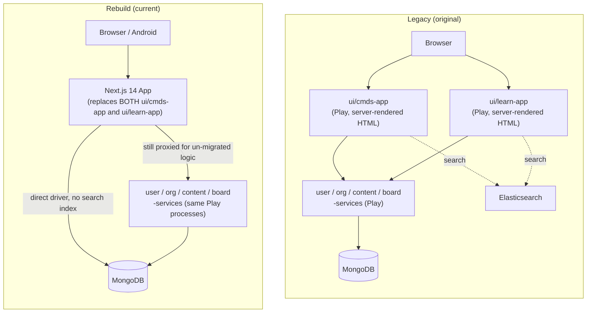

# uPrep — Legacy vs. Rebuild Comparison

| | |
|---|---|
| **Purpose** | State precisely what "legacy" refers to, what has been replaced, what still runs underneath the rebuild, and every place this project found the rebuild's assumed behavior didn't match legacy's actual behavior. |
| **"Legacy" precisely means** | The two Play Framework, server-rendered web applications `ui/cmds-app` (staff console) and `ui/learn-app` (student app) in `legacy/lms-master`, plus the domain services they and the rebuild both depend on. |
| **Confidence note** | Every row below is either (a) confirmed by reading the cited legacy source file, (b) confirmed by comparing behavior against live legacy service responses, or (c) explicitly marked as a project decision rather than a legacy-fidelity claim. Nothing here is asserted from general assumption about what a system like this "probably" does. |

---

## 1. The shape of "legacy" itself

The legacy monorepo is a real, if aging, microservices architecture — 12 top-level domains, each usually split into `-commons` (shared models), `-mgmt` (business logic library), `-services` (deployable Play HTTP API):

`billing`, `board`, `cmds`, `comm`, `commons`, `content`, `event`, `organization`, `social`, `static-resources`, `ui`, `user`, `viewer`.

Of these, the current production deployment starts **exactly four** backend services (`user-services`, `organization-services`, `content-services`, `board-services` — see `platform/deploy/entrypoint.sh`) and the rebuild calls **exactly those same four** (`lib/config.ts`). The two legacy **web** applications that used to be the actual front door — `ui/cmds-app` (controllers: `QrPeople`, `QrPrograms`, `QrModules`, `QrDevices`, `QrNotification`, `QrBilling`, `QrSchedule`, `QrChannels`, `QrPlans`, `QrProducts`, `QrInventory`, `QrSaleDetails`, `Widgets`, and more) and `ui/learn-app` (controllers: `MyContents`, `Tests`, `Institute`, `Profile`, `Payments`, `Invoices`, `Register`, `Security`, `UserMessages`, `Share`) — are **not running in production anymore**. The Next.js app has fully replaced them as the thing users' browsers talk to; it just still reaches into the four data services above for what it hasn't natively reimplemented.

`billing`, `comm`, `social`, `event`, `viewer`, and `cmds/cmds-services` exist in source but are dormant in this deployment — not proxied, not started. Any feature that lived only in those modules is, as far as this rebuild is concerned, not currently present (its data may still exist in Mongo, but nothing in the current stack reads or writes it through those services).

## 2. Scale of the rebuild — the numbers

The clearest, least arguable claim first: **100% of the legacy web UI has been replaced.** Not most of it, not the visible parts — `ui/cmds-app` and `ui/learn-app` are the two Play applications a browser actually rendered against in the old system, and neither is running in the current production deployment at all (§1, confirmed directly from `entrypoint.sh` — it starts four backend data services and zero legacy web apps). Every page and every screen a user sees today is Next.js/React code, written from scratch against the same underlying data.

To size that replacement fairly, this table compares the legacy code that specifically constitutes those two web apps — not legacy's backend services, most of which are still running underneath the rebuild and were never meant to be replaced by this project — against the current rebuild:

| | Legacy `ui/cmds-app` + `ui/learn-app` | Rebuild (`platform/web`) |
|---|---|---|
| Language / framework | Java (controllers) + Scala/HTML templates, Play Framework 2.1 | TypeScript + React, Next.js 14 |
| Controller / route files | 83 Java controllers | 91 API route handlers |
| Template / page files | 488 HTML templates | 74 page components |
| **Total files** | **571** | **200** (`.ts`/`.tsx` across `app/`, `components/`, `lib/`) |
| **Total lines of code** | **61,373** | **34,248** |
| Code shared between the two | None — different language, different runtime, zero code reuse is possible | |

**Read the file/LOC gap correctly — it is not "less was built."** Legacy typically split one feature across several templates (a list view, a detail view, an edit modal, and an empty state as four separate `.html` files); the rebuild consolidates that into fewer, dynamic components — 74 pages covering what 488 templates did, a real architectural consolidation, not a smaller effort. And legacy's controllers mix routing with business logic in the same Java file, where the rebuild counts pages and API routes as separate files in the table above; add them together (74 + 91 = 165 route-level files) and the "fewer moving parts, same or greater capability" pattern holds throughout this project — see the feature-status table in §4, where the rebuild's inventory is consistently equal to or larger than legacy's for every area actually rebuilt.

### 2.1 It's not a port — it's a from-scratch redesign

Every one of those 200 rebuild files is original code written against the same MongoDB collections and (where still needed) the same legacy backend services — none of it is legacy's Java transpiled, ported, or auto-converted. Concretely, this session's work included a full visual and structural redesign of the student- and staff-facing surfaces, verified by direct before/after comparison against the running legacy templates and the rebuild's own prior state:

- **A new design system, applied consistently**, not per-page patchwork: a warm cream/navy palette (`#EDEEE9`/`#16233D`) with serif display type replacing legacy's plain, dated HTML styling; a per-subject accent-color system (Physics blue, Chemistry teal, Maths violet, Botany green, Zoology amber) applied to course cards, sidebar navigation, and content badges throughout, none of which exists in legacy at all.
- **Every major student screen rebuilt with real UI, not a template swap**: the Digital Library's subject cards went from a flat, single-color header bar to a two-stop gradient with an icon badge and live stat chips; the Doubts Forum gained a hero section and subject-color-coded cards where legacy has a bare list; the shared app shell (header + sidebar) was rebuilt with per-section color coding and a personalized greeting, replacing a static, unstyled nav; every "no content" empty state across the app was replaced (legacy's dated hand-drawn "Sorry! No content to show.." illustration, still present in the rebuild's early version, is gone — swapped for an icon-in-gradient-circle treatment matching the new system).
- **Test creation was rebuilt as a materially different product**, not a re-skin: legacy's single-section test model became an admin-configurable multiple-Sections model (independent question-type mixes and marking schemes per section, verified against real production test documents — see the Architecture Deep Dive §7.4); an Instant Test Generator with multi-subject, multi-chapter, difficulty-split generation was added, which has no legacy equivalent at all.
- **A capability with no legacy equivalent whatsoever**: the per-student Analytics page (subject- and question-type-level accuracy resolved through the live board-tree hierarchy, a score trend, and derived strengths/focus-areas) replaces legacy's one flat table of past scores — this is new product surface, not a redesign of an existing one.

None of the above is a claim about visual taste — it's a structural fact: the rebuild's component tree, state management, styling approach, and data-fetching pattern share nothing with legacy's server-rendered Scala templates. A legacy template cannot be dropped into the rebuild or vice versa; every screen was independently built.

## 3. Architecture, side by side

The single biggest structural change: **two separate legacy web apps collapsed into one Next.js app**, which now also absorbs everything Elasticsearch used to do for browse/listing (by querying Mongo directly instead — a deliberate trade-off, see §6).

## 4. Feature-area migration status

Status legend: **Replaced** = fully reimplemented, legacy web app no longer used for this · **Replaced+Enhanced** = reimplemented and then extended beyond legacy's original behavior · **New** = did not exist in legacy at all · **Removed** = existed in the rebuild at some point, deliberately taken back out.

| Area | Legacy | Rebuild | Status |
|---|---|---|---|
| Staff login / access gate | `Security.checkAccess()` interceptor in `ui/cmds-app` | `middleware.ts` edge gate, same staff-profile rule (`MANAGER`/`TEACHER`/`EDITOR`/`SALESPERSON`) | Replaced |
| People Management | `QrPeople.java` | `/cmds/tools/people` + `/cmds/tools/people/bulk` | Replaced+Enhanced (CSV bulk import with auto-generated credentials is new) |
| Academic Structure | Implicit in `Institute.java` / org data model | `/cmds/tools/academic` dedicated screen | Replaced+Enhanced |
| Content Resources / Question Bank | `QrModules`, `QrDocuments`, general CMDS content screens | `/cmds` resources + `/cmds/questions` | Replaced+Enhanced (chapter/topic display resolved live via board-service, added this session) |
| Test creation | `QrTests.createTest()` (manual) / `createTestAuto()` (auto), **one shared Setup screen**, forking on an auto-generate flag | `/cmds/tests/new` — **now correctly mirrors this**: one Setup → Subjects & Types → Chapters flow with a mode toggle | Replaced — but see §5 for how this project initially got it wrong |
| Instant Test Generator (multi-subject, difficulty split, review & replace) | Not confirmed as existing in legacy in this form | `/cmds/tests/new` auto mode | New |
| Course Packs (bundle-grant courses across orgs) | Not part of legacy's model | Built, then explicitly removed by product decision ("no concept of Other Courses" / Academic Structure supersedes it) | Removed |
| Test-taking (student) | `Tests.java` (`testPage`, `testPageDirect`, `leaderBoard`) | `/test/[id]` | Replaced+Enhanced (see §5, one-attempt rule) |
| Digital Library (student content browsing) | `MyContents.java`, subject-card tree (`Library/subjects.html`) | `/learn/courses` | Replaced — rebuilt to match legacy's real structure after an earlier version incorrectly duplicated it with a second flat "Library" section (removed) |
| Leaderboard / toppers | `_getToppers()` / `toppersData`, **passed only into the teacher template**, never the student template | Rebuild initially showed peer leaderboard data to students (unverified assumption) | Corrected to match legacy: staff-only, removed from student surfaces |
| Doubts Forum | `social`/legacy doubt flow (module not actively proxied — see §1) | `/learn/doubts`, direct Mongo (`discussions`/`answers`) | Replaced (native data model, not a proxy to the dormant `social` service) |
| Student Analytics | Legacy has a basic "Result Analytics" list screen | `/learn/analytics` — score trend, per-subject accuracy (via board-tree resolution), per-question-type accuracy, strengths/focus-areas | New (far beyond legacy's flat table) |
| Sidebar navigation (student) | `header.html` + `conf/messages` — exactly 5 items: Digital Library, Programs, Doubts Forum, Analytics, Recent Activity | Rebuild had accumulated 14 nav items before being trimmed back to legacy's real 5 | Corrected to match legacy |
| Mobile app | No evidence of a legacy mobile app in this repository | Native Android app (Compose), evolving from WebView shell to native screens + offline downloads | New |

## 5. Business-rule fidelity findings

These are cases where this project's assumption about "what legacy does" was wrong, discovered by reading legacy source or live legacy data, and then corrected. Recorded here because they're exactly the kind of drift a "rebuild matches legacy" claim needs to survive scrutiny on.

1. **Test retake behavior.** Assumed: retaking a test should just work and analytics should reflect all attempts. Actual legacy rule, read directly from `AnalyticsManager.startAttempt()`: `isMultiAttemptAllowed()` is hardcoded `return false`, but the real behavior is more specific than "blocked, always" — a prior attempt with `endTime == 0` (abandoned mid-test) is silently **resumed** (same attempt id, status reset to ONGOING), and it's only a prior attempt that actually *finished* that triggers `MULTI_ATTEMPTS_NOT_ALLOWED`. `recordAttempt()` re-checks this on every single answer, not just at start (FINISHED/PAUSED/RESUMED states are each rejected explicitly). Legacy's UI never lets a student reach the rejection in the finished case — it checks status up front (`Tests.java testPageDirect` / `_isReAttemptTest()`) and routes straight to the existing result. The rebuild now matches this precisely (`alreadyAttempted` flag + a read-back-only result endpoint), not just the coarser "one attempt ever" version originally assumed.
2. **Leaderboard visibility.** Assumed (first pass): showing peers' names/scores to students matches legacy's "real gamification feature." Actual: `toppersData` is computed for every role in `MyContents.java testPage()`, but only ever passed into `postTestTeacherPage.html`'s render call — the student template never receives it. Corrected by removing leaderboard/peer data from student-facing surfaces entirely, not just filtering it.
3. **Test creation as two separate flows.** Assumed: manual test creation and auto-generate are two different products (matching how the rebuild had originally split them into two top-level pages). Actual: `QrTests.createTest()` and `createTestAuto()` **share one Setup screen**, forking only on an auto-generate flag. Corrected to a single unified flow with a mode toggle.
4. **Sidebar navigation scope.** Assumed: more nav destinations is more feature-complete. Actual, from `header.html` + `conf/messages` TXT_* constants: legacy's real sidebar has exactly 5 items. The rebuild's other 9 pages (Store, Live Classes, Scheduled Tests, Assignments, Challenges, Messages, Playlists, Certificates) still exist and function, they're just not real top-level nav destinations in legacy, so they were removed from the nav rather than deleted outright.
5. **Digital Library duplication.** The rebuild had added a second, flat "browse everything by type" section beneath the real subject-card tree, framed as covering a gap. On review, its "Other Shared Content" grant logic actually included the **entire** enrolled-course subtree (not just genuinely untagged content), so it was showing duplicates of what the subject tree already displayed. Per an explicit product decision this session ("there is no concept of Other Courses"), the whole section — and the component backing it — was removed rather than patched.
6. **Board Tree depth.** Assumed (early on): a 2-level Subject → Chapter tree. Actual, confirmed via `BoardXLParser`'s `maxAllowedColumns=3` and the "Add SubTopic" control in legacy's tagging UI: a real 3-level tree (Subject → Chapter → Concept). The rebuild's board-tree UI now matches.
7. **Bulk student upload format.** Modeled on legacy's real `StudentsXLParser` / `OrgMemberManager.uploadOrgStudents`: one Program chosen up front for the whole batch, with Center + Section supplied per row. Legacy's XL format also carries gender/DOB/parent-contact columns this rebuild's member model doesn't store — those are intentionally dropped, not silently lost (documented in the bulk-upload page's own header comment).

## 6. Deliberate trade-offs (not fidelity bugs — explicit decisions)

| Trade-off | Legacy | Rebuild | Why |
|---|---|---|---|
| Search / browse indexing | Elasticsearch-backed listing endpoints | Direct MongoDB queries | The legacy Elasticsearch index isn't populated/reachable in this environment; direct Mongo queries with in-app sorting/filtering substitute for it. This means full-text/fuzzy search is weaker than legacy's real ES-backed search wherever the rebuild relies on this substitution. |
| Session model | Play server-side session | Stateless HMAC-signed cookie (§ Architecture doc, §6) | Required by the Edge middleware architecture; not a legacy behavior being matched, a new constraint being solved. |
| Password storage for new accounts | Delegated to `user-services` | Self-issued `scrypt` hash for locally-created accounts, legacy proxy kept for legacy-issued accounts | Lets CMDS-created accounts work without a round trip to legacy for every login. |

## 7. A risk the new architecture introduced, then found and fixed

The session-model change in §6 is worth a second look specifically because it's where a real bug came from, not just an architectural swap. Legacy's Play server-side session meant a request's identity was never something a route had to think about separately — it was just *there*, tied to server-side state. The rebuild's stateless model means every route receives identity as data on the request, and it's up to that route to get it from the right place (the signed cookie, via `sessionFromReq()`) rather than the wrong one (a client-supplied `userId` field).

A systematic read of all 92 API routes (see the companion Architecture Deep Dive, §6.2, for the full route-by-route table) found that roughly a fifth of them had done exactly that — trusted a client-supplied `userId` instead of the session, in some cases going back to this project's earliest `/api/learn/**` routes. This wasn't present in legacy, and it wasn't an intended trade-off; it's the specific shape of bug this particular architecture change makes possible if a route is written carelessly. All instances found have been remediated (session-derived identity throughout, plus two staff-side cross-tenant org checks that were missing entirely); see the Deep Dive for the full finding, fix, and verification.

## 8. Net new capability inventory (does not exist in legacy at all)

- Advanced per-student analytics (subject/question-type accuracy resolved through the live board-tree hierarchy, score trend, strengths/focus-areas)
- CSV bulk student import with auto-generated Institute ID + password, downloadable as a credentials sheet
- Instant Test Generator (multi-subject, multi-chapter, difficulty-split generation with per-question review/replace)
- Admin-defined multiple Sections within a single test subject, each mixing question types under independent marking schemes
- Chapter/topic display on the Question Bank list, resolved live from the board-tree service
- Native Android app with offline content downloads (Room + WorkManager)
- The visual redesign itself (energetic, subject-color-coded UI) — a product decision, not a legacy-parity concern

## 9. What still fails if legacy goes down

Because four legacy Play services are proxied live rather than fully absorbed, the following break if `lmsbe` is unreachable: Board Tree browsing/tagging (question bank chapter filters, doubt tagging, student analytics' subject rollup), the actual test-taking screen's question content (`getTestInfo`/`getTestQuestions`), legacy-issued-account login, and whatever `organization-services` calls are still in `lib/legacyOrg.ts`. This is the direct cost of the Strangler Fig approach at its current stage of completion — it is not yet a fully independent system.
