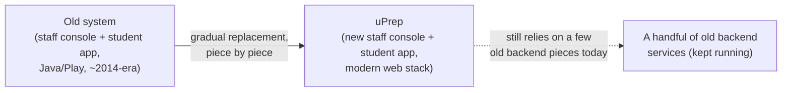

# uPrep — Executive Summary

*A plain-language overview of what uPrep is, how it's built, and where it stands. No engineering background required.*

## What is uPrep?

uPrep is software for coaching institutes that prepare students for competitive exams (like India's JEE/NEET). One institute signs up and gets two things:

- **A back-office console** for their staff — enroll students, build a question bank, assemble tests, upload videos and study material, see how students are doing.
- **A learning app for their students** — watch videos, read e-books, take tests, ask doubts, and (new, this year) see a genuinely detailed breakdown of their own performance.

It's built to serve **many institutes on one system** — each institute's data is kept separate, and a platform-level super-admin can manage institutes and share content between them.

## Where it came from

uPrep runs on top of an older system ("legacy") built years ago on aging technology (Java/Play Framework, from roughly the 2013-2015 web-development era). That system works, but it's expensive to change: old tooling, a search engine dependency that isn't functioning in this environment, and a codebase spread across a dozen separate services.

## What this project is doing about it

Rather than a risky "stop everything, rebuild from scratch" approach, this is a **gradual replacement** ("strangler fig" — the new system grows around the old one until the old one is no longer needed). Concretely:

- The two screens users actually look at — the staff console and the student app — have been **fully rebuilt** on a modern stack (Next.js/React), and are what real users see today.
- The reliable, working parts of the old system that don't need touching yet (a handful of backend data services) **are still running underneath**, quietly, and the new app calls them when needed — so nothing had to be thrown away before it was ready to be replaced.
- Every rebuilt feature was checked against what the old system *actually* does (by reading its real source code and real production data), not against a guess of what it does. Several real mismatches were found and fixed this way — see the companion comparison document for specifics.

## What's been delivered

- A fully rebuilt, modernized **staff console**: enrolling students (including bulk import from a spreadsheet), organizing the institute's programs/centers/batches, managing the question bank and video library, and a much richer test-creation tool than the old one had (multiple sections per test, auto-generated tests split by chapter and difficulty).
- A fully rebuilt **student app**, redesigned to be visually engaging rather than the old system's plain, dated look, plus a genuinely new **advanced analytics** page — students can now see exactly which subjects and question types they're strong or weak in, not just a bare list of past scores.
- A **native Android app**, which didn't exist before, now with the ability to download content for offline viewing.
- A full, systematic security review of every backend endpoint (all 92 of them) — which found and fixed a real, live issue: about a fifth of the student-facing endpoints were trusting an identity value the caller supplied rather than verifying who was actually asking, meaning a logged-in student could, in principle, have viewed or changed another student's data. This was closed the same day it was found, verified against the live system, and is now clean. (This class of bug is specific to the new architecture's design — the old system's session model didn't have this exposure — so it's a cost of modernizing, not a legacy carryover. The full technical writeup is in the companion Architecture document.)
- A live, running deployment, currently serving real accounts and real content.

## Where it stands / what's next

- The new system is live and functioning for the core workflows (staff managing content and students, students learning and testing).
- It still depends on a few pieces of the old backend for some things (test content delivery, some organization-level lookups, the subject/chapter tagging tree). That dependency is the main thing left to close out.
- The current deployment runs on a single server with no redundancy — fine for the current stage, but worth planning around before scaling to significantly more institutes or students.
- The database is on an old, unsupported version, inherited from the legacy system's requirements — a real technical debt item to plan for, not an emergency.

## Bottom line

The rebuild is not a rewrite-from-a-blank-page bet — it's a methodical replacement of the parts users touch, verified piece-by-piece against what the old system actually did, with new capability (analytics, mobile, richer test tools) layered on top rather than deferred until "after the migration." The main remaining work is finishing the handover from the old backend pieces still in the loop, and hardening the deployment for scale.
